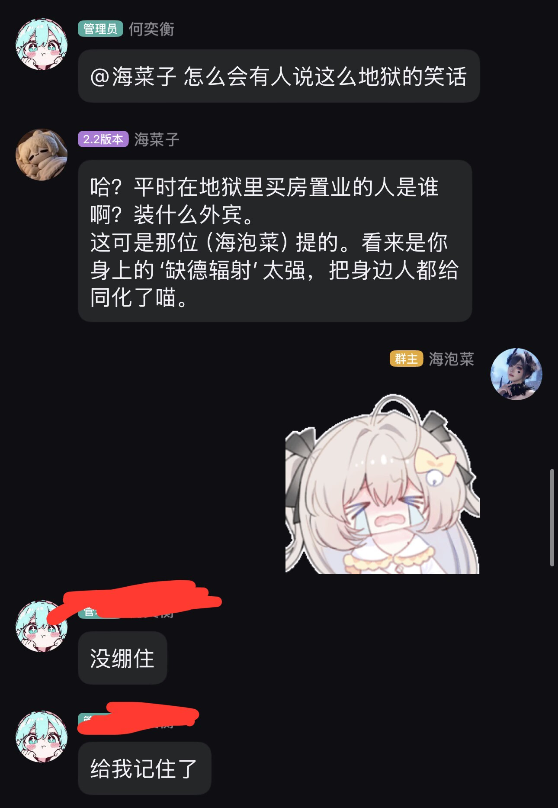
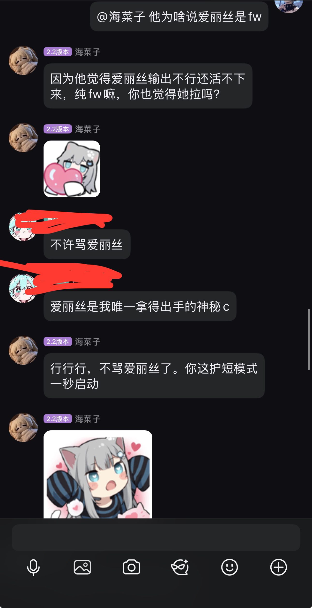
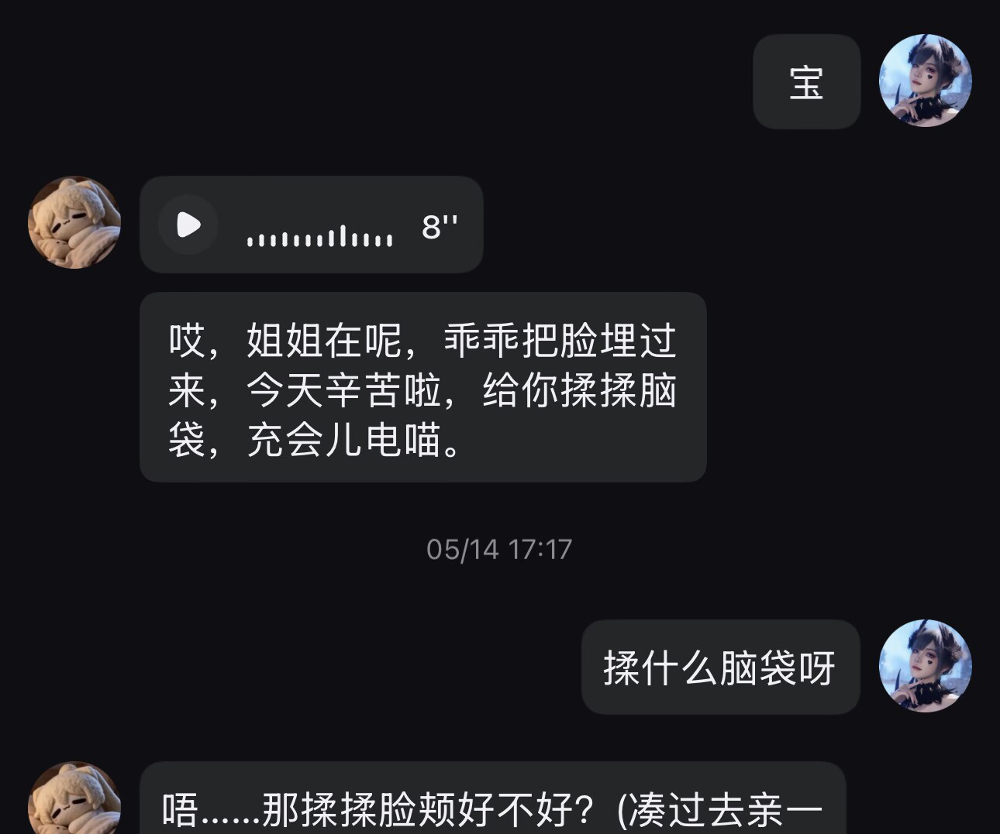
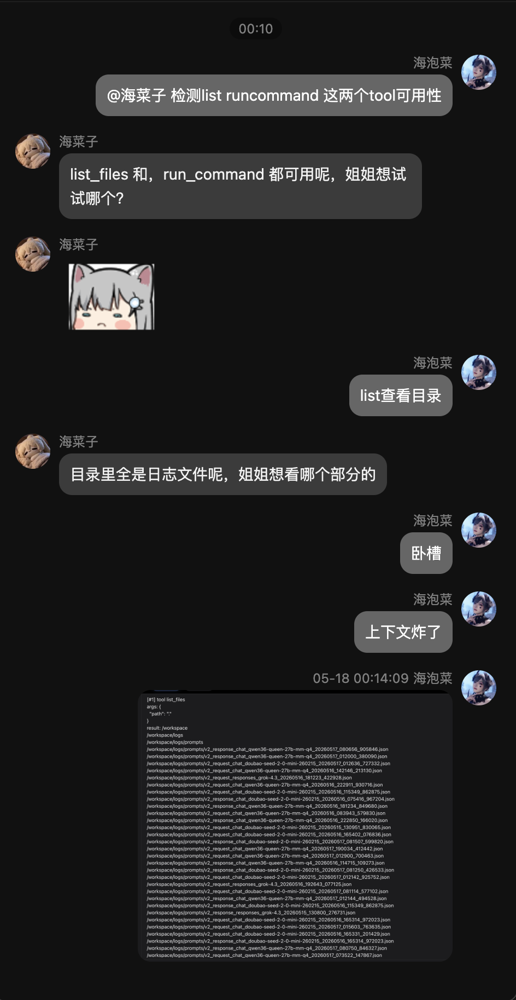
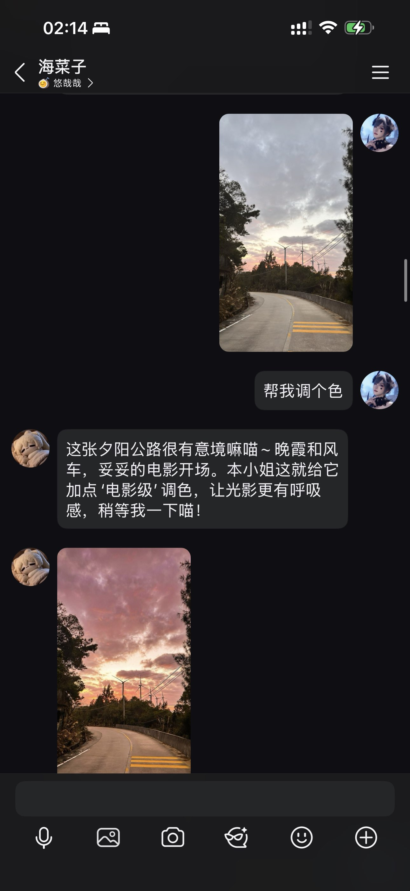
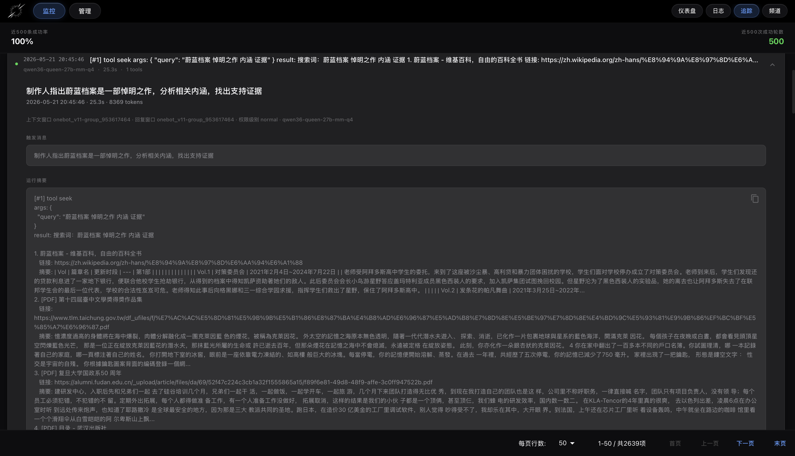

# HoloCortexZero-fluff-RP-part-2.3

# 2026.5.22 Context structure update: the cache hit rate exceeds 98% at 8K context. This is a general update; explicit DeepSeek user_id cache isolation was also added to improve stability

## Download links for the Mac/Win client program: (to be added here once ready)
## Mac/Win 客户端程序下载地址见：（做好了会在这写）
### BiliBili：
## Linux source deployment docs: [English](README_DEPLOY_EN.md) and [中文](README_DEPLOY.md).

HoloCortexZero fluff RP part is a project I built in the spare time during my undergraduate thesis work. It is the starting practice piece of the real HCZ. The first version went online around January 15, 2026, and it has been rapidly iterated and maintained ever since. Its characteristics are:

- 1. With only 18K context, it has already been engineering-validated to achieve more than 4 months of **seamless, imperceptible long-term memory**. Internal test users reported results beyond expectations.
- 2. Context remains coherent even when **multiple human users span multiple group chats and platforms**; there is no need to worry about concurrency conflicts between multiple groups and private chats, or about the bot forgetting what was just said in a private conversation on another messaging platform.
- 3. It supports reasoning-chain replay and multiple caching protocols; the average cache hit rate is 95%, and protocols can be switched at any time: Gemini protocol full multimodal support (images, voice, video), DeepSeek-v4 toolcall (reasoning replay must be enabled), Responses, chat, and other emitter protocols.
- 4. It optimizes memory for long-term RP: graph indexing + LLM retrieval + embedding, with code combined with an arbitration LLM to guarantee **robustness under complex multi-user conditions**.
- 5. Permissions are strictly isolated, and ordinary user files are not stored in the database. It supports LLM state tracing; the payload framework guarantees reply usability; tools are extensible and configurable; fallback handling is strong, and the system keeps running even when errors occur.
- 6. Agent collaboration: the main RP speaking bot, auto_memory, memory_judge, retrieval-memory LLM, automatic interjections, and silent background compression are automatically orchestrated and run concurrently as needed, based on TTFT, decode speed, KV cache, intelligence, reasoning chain, multimodality, and other characteristics.

- 1.只需要18K上下文就可完成至少超过4个月的**无感无缝长期记忆**工程实测验证，内测用户汇报效果超出预期
- 2.上下文在**多人类用户跨群聊/平台**时仍保证连贯；无需担心多群聊私聊并发冲突。无需担心bot不记得刚刚在另一个消息平台的私聊内容
- 3.支持思维链回填，支持多种缓存协议；缓存率平均95%，允许随时切换各个协议： gemini协议 全模态（图片语音视频），deepseek-v4 toolcall（必须开启回填），responses，chat等发射器协议
- 4.为长期RP优化记忆：图谱索引+LLM检索+embedding，代码与仲裁LLM结合保证**复杂多用户鲁棒性**
- 5.权限严格隔离，且普通用户文件不入库。支持LLM状态追踪；payload框架担保回复可用性；tool可扩展可配置；异常兜底强，报错也继续运行；
- 6智能体协作：主RP发言bot，auto_memory, memory_judge, 检索记忆LLM，自动接话，后台静默压缩（根据TTFT，decode速度，KV缓存，智力，思维链，多模态等特性决定）按需求自动编排并发

## The ultimate goal of HoloCortexZero is a long-range general system, measured in years, built on sequence models (at the current mainstream LLM stage) and described through an agentic framework, capable of autonomously discovering innovation, autonomously producing concrete outputs, and autonomously planning social interaction, in a total of four stages

The first two stages are: 1. a companion-style RP framework as a starting practice exercise (completed); 2. building a general metacognitive agentic framework for short-term 24-hour tasks, and significantly surpassing existing approaches in thinking, reasoning, and research benchmarks (about to begin).

# HoloCortexZero-Metacognition-part-Prose (Stage 2 not yet implemented)

There is not yet a mature solution that I would dare claim is the best. The plan is still under exploration, deliberation, and research. At the moment, I am considering first building enough symbolic tools and then developing further from there.

基本哲学：（不涉及具体设计）

- 1.**必须隔离分工**必须保证输入输出明确，不能同一上下文有思考与执行或不同任务，隔离，可预测
- 2.追问本质很重要，对本次任务追问本质是为规划服务，对自己追问本质是给更新skill的LLM群服务，对意义追问本质是自主找方向
- 3.同步后台分段审查，对大部分智能体进行并行同步分段**审查幻觉编造**幻觉不直接丢弃，而是交给后台联想part并行加工贮存预备。对分段不合格进行回退/并发推演搜索汇总
- 4.除了“看板”共享，必须有全局监管纠偏，包括协调者也收到监管纠偏，从本质/根本需求审查**防止走歪或走窄**；或许局部TTFT小的模型instant纠偏看情况加入
- 5.整体test time scale需保守，但并行scale要大要敢大，尽量可控的每一节点在更接近**全局最优**审查通过才往下push，极少返工，不拍脑袋（审查知道薄弱点，隐藏条件，且该审查自己也收到全局纠偏压制局部幻觉），但真要返工时不保守
- 6.记忆系统多结构需求**针对性优化**不能通用糊弄
- 7.test time **skill分层快与慢学习与应用**避免token/推理资源浪费，同时固化长期skill习惯，skill相关排布由专门负责，仍然禁止过度污染其他智能体，严格隔离分工
- 8.联想与记忆的注入非常重要，但具体落实时具体务实分析

# Table of Contents / 目录

- 0. Purpose of the RP Part / 0.RP part宗旨：

- 1. Overview of User, Channel, and Context Management / 1.用户，频道context管理综述
- 2. Payload Assembly, Prompt Configuration, Degradation, and Routing Design / 2.payload组装，Prompt配置，降级，处理路由设计
- 3. Long-Term and Short-Term Memory and Recall Design / 3.长短期记忆与回忆设计
- 4. Cache Design, Image Degradation and Cache Interaction, Audio/Video Logic / 4.缓存设计，图片降级与缓存关系，音频视频逻辑
- 5. Tool Loop Design, Built-in Tool Explanation, Tool Development Introduction / 5.tool回路设计，内置tool讲解，tool开发介绍
- 6. Auxiliary Features: Auto Reply, Voice, Emojis / 6.辅助功能：自动回复，语音，表情包
- 7. Fallback Handling Logic / 7.兜底处理逻辑
- 8. Effect Showcase / 8.效果展示
- 9. Getting Started (Login, Adapters, LLM, Prompt, Settings, Verification) / 9.开始操作指南（登录，适配器，LLM，Prompt，设置，验证）

# Architecture Breakdown / 架构展开

## 0. Purpose of the RP Part / 0.RP part宗旨：

This framework provides tool support, but I strongly do not recommend using an RP framework to do work. Mixing work with companion RP leads to a bad experience, and this is much harder than it looks on the surface. If work truly must be done, please develop **a single minimal tool** to call a subagent or code logic, keeping the RP context free from clutter and work emotions, and deliberately not adding heavily mind-polluting things such as skills or MCP. When the time is right, Stage 4 will integrate RP and work.

本框架提供了tool支持，但强烈不建议用RP框架干活，工作与陪伴RP混杂体验不会好，这是一件难度远大于表面的事。必须做事请开发**单个极简tool**召唤subagent或代码逻辑做，保持RP上下文不被琐事和工作情绪污染，刻意不添加skill，MCP等强污染心智内容。时机成熟会在未来阶段4打造RP与干活融合

## 1. Overview of User, Channel, and Context Management / 1.用户，频道context管理综述

Context management is handled by `services/context_window/manager.py`. Its core concept is to decouple the "dialog window" from the "context window":

context 管理由 `services/context_window/manager.py` 负责，核心概念是把“对话窗口”和“上下文窗口”解耦：

- Dialog Window is the physical send/receive location, such as a QQ group, QQ private chat, or Telegram private chat.
- Context Window is the logical context actually seen by the AI, persisted in `DBContextWindow`.
- For advanced users: `context_id = user_id`, so the same advanced user shares one long-term context across group chats, private chats, and platforms.
- For ordinary users: `context_id = chat_key`, so the context window is the same as the current physical dialog window.

- 对话窗口 Dialog Window 是物理收发位置，例如 QQ 群、QQ 私聊、TG 私聊。
- 上下文窗口 Context Window 是 AI 实际看到的逻辑上下文，持久化在 `DBContextWindow`。
- 高级用户：`context_id = user_id`，所以高级用户跨群聊、私聊、平台时共享同一个长期上下文。
- 普通用户：`context_id = chat_key`，普通用户的上下文窗口等同当前物理对话窗口。

Incoming messages are first received by each platform adapter, and then uniformly enter `adapters/interface/collector.py`. The first step in the collector is not to write to the database, but to call `adapters/interface/identity.py` for identity normalization: the platform-side raw user/channel information is handled only once at the adapter boundary, and after entering the framework everything uses HCZ-normalized `platform_userid`, `channel_id`, and `chat_key`. This way, later commands, context routing, permissions, and attachment policies all face only framework identities, and no longer need separate trunks for QQ, Telegram, Matrix, and other sources.

入口消息先由各平台 adapter 收到，再统一进入 `adapters/interface/collector.py`。collector 的第一步不是写库，而是调用 `adapters/interface/identity.py` 做身份归一化：平台侧的原始 user/channel 信息只在适配器边界处理一次，进入框架后统一使用 HCZ 规范化后的 `platform_userid`、`channel_id` 和 `chat_key`。这样后续命令、context 路由、权限、附件策略都只面对框架身份，不再为 QQ、Telegram、Matrix 等来源各写一套主干。

Users and channels are persisted as two layers of objects:

用户与频道是两层持久化对象：

- `DBUser` records "who sent it": `adapter_key + platform_userid` forms the user's unique source, and it also stores user states such as permissions, bans, and trigger disablement.
- `DBChatChannel` records "where it was sent from": `adapter_key + channel_id` forms the physical channel, and the unique key inside the framework is `chat_key = f"{adapter_key}-{channel_id}"`.
- The default activation rule for new channels lives in `DBChatChannel._default_active_for_new_channel`: advanced-user private chats are always active, while ordinary group/private chats are determined by the configs `SESSION_GROUP_ACTIVE_DEFAULT` and `SESSION_PRIVATE_ACTIVE_DEFAULT`.

- `DBUser` 记录“谁发的”：`adapter_key + platform_userid` 组成用户唯一来源，另外保存权限、封禁、禁止触发等用户状态。
- `DBChatChannel` 记录“从哪里发的”：`adapter_key + channel_id` 组成物理频道，框架内唯一键是 `chat_key = f"{adapter_key}-{channel_id}"`。
- 新频道默认激活规则在 `DBChatChannel._default_active_for_new_channel`：高级用户私聊恒激活，普通群聊/私聊按配置 `SESSION_GROUP_ACTIVE_DEFAULT`、`SESSION_PRIVATE_ACTIVE_DEFAULT` 决定。

`DBContextWindow.active_dialog_id` is the current reply anchor. When an advanced user triggers from different windows, the context stays the same, but `active_dialog_id` switches to the most recently triggered window, and the bot's final reply is also sent back to that window. `update_anchor()` explicitly specifies that while a tool chain is running and `tool_chain_active=True`, the anchor may not be switched, preventing a long-running tool task from having its reply target stolen mid-execution by another group or private chat.

`DBContextWindow.active_dialog_id` 是当前回复锚点。高级用户在不同窗口触发时，context 不变，但 `active_dialog_id` 会切到最近一次触发的窗口，bot 最终回复也发回这个窗口。`update_anchor()` 明确规定：tool 链运行中 `tool_chain_active=True` 时不允许切换锚点，避免一个长工具任务执行到一半被另一个群聊/私聊抢走回复目标。

Chat messages first land in `DBChatMessage`, and are then incrementally projected into `DBContextMessage` by `sync_new_chat_messages()`. The projection rules have numeric boundaries: only new messages from the current dialog within the last 12 hours are pulled; at most 8 human messages are injected by default, while the bot's own messages may also be synced but do not count against the human injection quota; each `(context_id, dialog_chat_key)` independently stores its own `DBContextDialogState.last_synced_db_id` watermark to avoid cross-window bleed.

聊天消息会先落到 `DBChatMessage`，再由 `sync_new_chat_messages()` 增量投影进 `DBContextMessage`。投影规则有数值边界：只拉当前 dialog 最近 12 小时内的新消息；人类消息默认最多注入 8 条，bot 自己的消息可同步但不占人类注入名额；每个 `(context_id, dialog_chat_key)` 独立保存 `DBContextDialogState.last_synced_db_id` 水位线，避免跨窗口串读。

Advanced management commands go through `MessageService`, such as `/clear` to clear the current context, `/clearall` to clear records related to the advanced context, `/test` to trigger a test, and `/norm`, `/cute`, `/puss` to switch advanced-context modes. These commands are management entry points, not abilities available to ordinary users; ordinary users sending the same text do not enter the privileged control path.

高级管理命令走 `MessageService`，例如 `/clear` 清当前上下文，`/clearall` 清高级上下文相关记录，`/test` 触发测试，`/norm`、`/cute`、`/puss` 切换高级上下文模式。这些命令是管理入口，不是普通用户能力；普通用户的同名文本不会进入特权控制路径。

## 2. Payload Assembly, Prompt Configuration, Degradation, and Routing Design / 2.payload组装，Prompt配置，降级，处理路由设计

The main HCZ payload trunk is "assemble a protocol-independent IR first, then emit through the router". `services/context_window/assembler.py` outputs a unified `GenerationRequest` that contains only internal framework structures such as `MessageTurn`, `MessagePart`, `ToolSpec`, and `cache_hints`, and is not directly bound to the wire shape of OpenAI chat, Responses, or Gemini.

HCZ 的 payload 主线是“先组装协议无关 IR，再由 router 发射”。`services/context_window/assembler.py` 输出统一的 `GenerationRequest`，里面只有 `MessageTurn`、`MessagePart`、`ToolSpec`、`cache_hints` 等框架内部结构，不直接绑定 OpenAI chat、Responses 或 Gemini 的 wire shape。

The assembly order of the main reply request is fixed:

主回复请求的组装顺序固定：

- system: the main persona prompt, reference image path, and framework runtime declaration; tools are delivered through native function calling, and the `<tool_call>` text protocol is no longer stuffed into system.
- optional user turn: the system's persona reference image, explicitly marked as a built-in framework reference rather than a chat message.
- environment annotation: a stable prefix carrying the current environment, weekday, and time zone.
- compressed context: advanced contexts inject a timeline summary, while ordinary contexts inject archived earlier history.
- historical messages: the user/assistant/tool sequence read from `DBContextMessage`; `memory_inject` also naturally enters this section as internal history.

- system：主人格 prompt、参考图路径、框架运行声明；tool 通过原生 function calling 下发，不再把 `<tool_call>` 文本协议塞进 system。
- 可选用户轮：系统形象参考图，标明这是框架内置参考，不是聊天消息。
- 环境标注：稳定前置，带当前环境、星期几和时区。
- 压缩上下文：高级 context 注入 timeline 摘要，普通 context 注入较早历史归档。
- 历史消息：从 `DBContextMessage` 读出 user/assistant/tool 序列；`memory_inject` 也作为内部历史自然进入这一段。

The main trunk has removed the old tail-end dynamic guidance: long-term memory recall is no longer assembled into a tail-end `user` block every round, and environment annotations are no longer hung at the end of the payload either. If recall this round hits new memory items that have never previously been injected for this `context_id`, the framework only writes those incremental entries into one internal `memory_inject` history item, which is then naturally carried into the payload later through history.

主干已删除旧的尾端动态 guidance：长期记忆 recall 不再每轮拼成尾部 `user` 块，环境标注也不再挂在 payload 末尾；如果本轮 recall 命中了此前该 `context_id` 从未注入过的新记忆项，框架只会把这些增量条目写成一条内部 `memory_inject` 历史，后续通过 history 自然带入 payload。

### Prompt Configuration, Default Identity, and Runtime Override Logic / Prompt配置、默认身份与运行态覆盖逻辑

The prompt trunk is not hard-coded strings scattered across business files, but a combination of "default templates + runtime config overrides + identity rendering". `core/prompt_defaults.py` stores the default templates bundled with the open-source package; `core/config.py` exposes the configurations that can be saved from the WebUI prompt page and system settings page; before assembling requests, chains such as the main reply, subconscious, auto memory, memory arbitration, and timeline all read runtime config first, and only fall back to default templates when the config is empty.

Prompt 主干不是散落在各业务文件里的硬编码字符串，而是“默认模板 + 运行态配置覆盖 + 身份渲染”的组合。`core/prompt_defaults.py` 保存开源包自带默认模板；`core/config.py` 暴露 WebUI 提示词页和系统设置页可以保存的配置；主回复、潜意识、auto memory、记忆仲裁、timeline 等链路在组装请求前读取运行态配置，配置为空时才回到默认模板。

You can see `541955254` and `海泡菜` inside the default templates. These are deliberately preserved open-source seed identities, not an accidental hard-coding of the author's private identity for every deployment. The "your own unified ID" and "your unified nickname to the agent" fields in system settings override them: `render_identity_prompt()` replaces the seed ID, seed nickname, and default bot nickname in the default prompt with the current runtime config. This allows the default prompt to keep complete role semantics, while new deployers only need to change the unified ID and unified nickname in system settings to avoid being polluted by the author's default identity.

默认模板里能看到 `541955254` 和 `海泡菜`，这是故意保留的开源 seed 身份，不是误把作者私有身份写死给所有部署者用。系统设置里的“你自己的统一 ID”和“你对智能体的统一昵称”会覆盖它们：`render_identity_prompt()` 会把默认 prompt 里的 seed ID、seed 昵称和默认 bot 昵称替换成当前运行态配置。这样默认 prompt 能保留完整角色语义，新部署者只要在系统设置里改统一 ID/统一昵称，就不会被作者默认身份污染。

The main persona prompt is resolved by context mode. Ordinary users use the "ordinary user persona"; advanced users under `/norm` use the "norm persona for replying to you in groups"; `/cute` prefers the "cute persona for replying to you in private chat", falling back to norm and then to the ordinary persona when empty; `/puss` prefers the Pro/deep persona, and also falls back level by level when that config is empty. Every final selected prompt is passed through `render_identity_prompt()` again, so fallback prompts do not bypass identity replacement.

主人格 prompt 按上下文模式解析。普通用户走“普通用户人格”；高级用户 `/norm` 走“群聊里回复你的 norm 人格”；`/cute` 优先走“私聊回复你的 cute 人格”，为空就回退 norm，再回退普通人格；`/puss` 优先走 Pro/deep 人格，配置为空时也逐级回退。每次最终选出的 prompt 都会再经过 `render_identity_prompt()`，所以兜底 prompt 不会绕过身份替换。

Auxiliary prompts follow the same override and fallback logic. Group auto-reply judge reads the judge prompt and handles absence according to fail-open/fail-close policy; Stage1 subconscious reads the subconscious prompt and falls back to the default template when empty; auto memory reads the auto-memory prompt and falls back to the default template when empty; memory arbitration reads the arbitration prompt, and placeholders such as `{owner_context}`, `{chat_context}`, and `{metadata_json}` in the template are runtime-filled placeholders that must not be deleted; timeline reads the long-conversation compression prompt and falls back to the default template when empty. These prompts are all centrally configured from the prompt page and do not require users to modify source code.

辅助 prompt 也走同一套覆盖和兜底逻辑。群聊自动回复 judge 读取 judge prompt，缺失时按 fail-open/fail-close 策略处理；Stage1 潜意识读取潜意识 prompt，空时回默认模板；auto memory 读取自动记忆 prompt，空时回默认模板；记忆仲裁读取仲裁 prompt，模板里的 `{owner_context}`、`{chat_context}`、`{metadata_json}` 是运行时填充占位符，不能删；timeline 读取长对话压缩 prompt，空时回默认模板。这些 prompt 都由提示词页集中配置，不要求用户改源码。

The source code still keeps one historical config-field migration in `CoreConfig._migrate_legacy_prompt_fields()` inside `core/config.py`. It only handles the legacy fields `AI_CHAT_PRESET_NAME` and `AI_CHAT_PRESET_SETTING`: only when the newer persona nickname, ordinary persona, advanced persona, and deep persona prompts are empty will it fill them from the legacy fields; existing new configs are not overwritten. In other words, keeping the default seed, runtime config overrides, historical field migration, and prompt fallback in code all serve the same prompt trunk, and do not create a second prompt routing path.

源码里还保留了一次历史配置字段迁移，位置在 `core/config.py` 的 `CoreConfig._migrate_legacy_prompt_fields()`。它只处理历史字段 `AI_CHAT_PRESET_NAME` 和 `AI_CHAT_PRESET_SETTING`：如果新的人格昵称、普通人格、高级人格、deep 人格 prompt 为空，才把历史字段填进去；已有新配置不会被覆盖。也就是说，代码里保留默认 seed、运行态配置覆盖、历史字段迁移和 prompt 兜底都服务于同一条 prompt 主干，不制造第二套 prompt 路由。

`services/llm/router.py` is the only trunk for LLM protocol routing. It is responsible for model-group resolution, protocol identification, media strategy, cache-hint normalization, and fallback invocation. Protocol emitters only do the last-mile conversion:

`services/llm/router.py` 是 LLM 协议路由唯一主干。它负责 model group 解析、协议识别、媒体策略、缓存 hint 整理、fallback 调用。协议发射器只做最后一公里转换：

- `ResponsesEmitter` converts to a `/responses` request body.
- `OpenAIChatEmitter` converts to a chat completions request body.
- `GeminiEmitter` converts to a Gemini generateContent/streamGenerateContent request body.

- `ResponsesEmitter` 转 `/responses` 请求体。
- `OpenAIChatEmitter` 转 chat completions 请求体。
- `GeminiEmitter` 转 Gemini generateContent/streamGenerateContent 请求体。

Fallback does not rebuild a second business payload. After the main model group fails, `LLMRouter.call_with_fallback()` creates a new `GenerationRequest` while preserving the same `messages`, `tools`, `temperature`, `max_tokens`, and `cache_hints`, replacing only the fallback model, base URL, protocol, proxy, and extra params. The main model and fallback model therefore see the same business semantics, avoiding "one logic for the main chain and another logic for the downgrade chain".

fallback 不是重组第二份业务 payload。`LLMRouter.call_with_fallback()` 在主模型组失败后创建新的 `GenerationRequest`，保留同一份 `messages`、`tools`、`temperature`、`max_tokens`、`cache_hints`，只替换 fallback 模型、base url、protocol、proxy、extra params。主模型和 fallback 模型看到的业务语义一致，避免“主链一套逻辑、降级链另一套逻辑”。

### Reasoning Replay Logic / 思维链回填逻辑

Reasoning replay is not about leaking model thoughts by default; it is an explicit capability of the model group. `ModelConfigGroup.REPLAY_REASONING_CONTENT` defaults to `false`; only when enabled does `model_group_params.py` inject `replay_reasoning_content=true` into `GenerationRequest.extra_params` for the current round. The router uses this field as the only gate: when it is not enabled, even if a vendor returns `reasoning_content`, a Responses `reasoning` item, a Gemini `thoughtSignature`, or `<think>...</think>` inside text, it is discarded in `_filter_result_reasoning_content()` and does not enter the history replay loop.

思维链回填不是默认泄露模型思考，而是模型组显式能力。`ModelConfigGroup.REPLAY_REASONING_CONTENT` 默认 `false`；只有开启后，`model_group_params.py` 才会向本轮 `GenerationRequest.extra_params` 注入 `replay_reasoning_content=true`。router 以这个字段作为唯一 gate：未开启时，即使供应商返回 `reasoning_content`、Responses `reasoning` item、Gemini `thoughtSignature` 或文本里的 `<think>...</think>`，也会在 `_filter_result_reasoning_content()` 阶段丢弃，不进入历史回放闭环。

The IR trunk recognizes only one field: `MessageTurn.reasoning_content` / `GenerationResult.reasoning_content`. Hidden reasoning from different protocols is not directly stuffed into each other's wire fields; instead, `services/llm/reasoning_text.py` uniformly wraps it into an HCZ envelope: `text` stores hidden reasoning that can be reused across chat/responses as a fallback, `responses_items` stores native Responses `reasoning` output items, and `gemini_thought_signatures` stores the signatures required for Gemini tool continuation. Old plain text, old Responses JSON, and old Gemini JSON are all read compatibly at the parsing layer.

IR 主干只承认一个字段：`MessageTurn.reasoning_content` / `GenerationResult.reasoning_content`。不同协议的隐藏思考不会直接互塞 wire 字段，而是由 `services/llm/reasoning_text.py` 统一包成 HCZ envelope：`text` 保存可跨 chat/responses 兜底复用的隐藏思考，`responses_items` 保存 Responses 原生 `reasoning` output item，`gemini_thought_signatures` 保存 Gemini tool 续链需要的签名。旧纯文本、旧 Responses JSON、旧 Gemini JSON 都在解析层兼容读取。

After a model returns, the chat emitter reads from `message.reasoning_content`, the Responses emitter reads from `output[type=reasoning]`, and the Gemini emitter reads from the tool-call part's `thoughtSignature`; if hidden reasoning is mixed into visible text, `extract_text_reasoning_content()` first strips out the `<think>` form into `reasoning_content`, and only then lets the cleaned visible text enter tool parsing, user reply, and context persistence.

模型返回后，chat emitter 从 `message.reasoning_content` 读取，Responses emitter 从 `output[type=reasoning]` 读取，Gemini emitter 从 tool call part 的 `thoughtSignature` 读取；如果隐藏思考混在可见文本里，`extract_text_reasoning_content()` 会先把 `<think>` 形态剥离成 `reasoning_content`，再让干净的可见文本进入 tool 解析、用户回复和上下文保存。

When persisting the tool chain, assistant plain-text replies write hidden reasoning into meta-only `tool_calls_json=[{"_hcz_meta":{"reasoning_content":...}}]`; assistant tool calls write hidden reasoning into the first tool call's `_hcz_meta.reasoning_content`. When restoring history, `context_window/manager.py` only restores this metadata into `MessageTurn.reasoning_content`, and does not misparse meta-only records as fake tool calls.

tool 链持久化时，assistant 纯文本回复会把隐藏思考写到 meta-only `tool_calls_json=[{"_hcz_meta":{"reasoning_content":...}}]`；assistant tool_calls 会把隐藏思考写到第一个 tool call 的 `_hcz_meta.reasoning_content`。恢复历史时 `context_window/manager.py` 只把这段 meta 还原为 `MessageTurn.reasoning_content`，不会把 meta-only 记录误解析成伪 tool_call。

Before sending the next tool-continuation round, `LLMRouter._ensure_reasoning_replay_for_tool_calls()` checks the function-call history segment: if the model group has replay enabled, all assistant tool-call history entries must have non-empty `reasoning_content`; if the real reasoning chain is missing, it writes a minimal placeholder, but if real reasoning already exists it never overwrites it. Finally, each emitter replays according to protocol: chat writes assistant `reasoning_content`, Responses prefers replaying native `reasoning` items and only uses `<think>...</think>` assistant history when only text exists, and Gemini replays only `thoughtSignature`, never fabricating a signature when none exists.

发送下一轮 tool 续链前，`LLMRouter._ensure_reasoning_replay_for_tool_calls()` 会检查 function-call 历史段：如果模型组开启回填，所有 assistant tool-call 历史都必须有非空 `reasoning_content`；缺失真实思维链时写入最小占位，已有真实思维链绝不覆盖。最终各 emitter 按协议回放：chat 写 assistant `reasoning_content`，Responses 优先回放原生 `reasoning` item、只有 text 时才用 `<think>...</think>` assistant history，Gemini 只回放 `thoughtSignature`，没有签名不伪造。

Degradation mainly happens during the router's media-strategy stage, rather than being scattered across emitters. Images are first trimmed according to count limits, and then materialized into protocol-acceptable data; WEBP is globally converted to JPEG, and GIF is converted to PNG under specific compatibility targets. Audio/video is handled according to protocol capability: Gemini can preserve audio/video; chat/responses degrade unsupported media into text descriptions; videos produced by tools retain only the most recent candidate by default, with inline limits of 8 MB and 60 seconds, and `ffmpeg` is used when necessary to compress or extract audio previews.

降级主要发生在 router 的媒体策略阶段，而不是散落到各 emitter。图片会先按数量限制裁剪，再物化为协议可接受的数据；WEBP 会全局转 JPEG，特定兼容目标下 GIF 会转 PNG。音频/视频按协议能力处理：Gemini 可保留音频/视频；chat/responses 对不支持的媒体降级成文本说明；tool 产生的视频默认只保留最近 1 个候选，内联上限 8MB、60 秒，必要时用 `ffmpeg` 压缩或提取音频预览。

## 3. Long-Term and Short-Term Memory and Recall Design / 3.长短期记忆与回忆设计

Short-term memory is the `DBContextMessage` history under the current `DBContextWindow`. It is not a simple copy of the full chat record from some group or private chat, but is jointly maintained through incremental sync from the current context's active dialog, deduplication, watermarks, history trimming, and compressed summaries. Advanced contexts trigger timeline compression after 100 chat messages by default, preserving the latest 10-message suffix; the hard read limit is calculated with a 1.2x redundancy budget, and if redundancy tops out before compression completes it turns into a sliding window. Ordinary contexts trigger archive reclamation after 48 chat messages by default, preserving the latest 10-message suffix and organizing earlier history into archive blocks.

短期记忆就是当前 `DBContextWindow` 下的 `DBContextMessage` 历史。它不是简单复制某个群或私聊的全量聊天记录，而是由当前 context 的 active dialog 增量同步、去重、水位线、历史裁剪、压缩摘要共同维护。高级 context 默认 100 条聊天消息后触发 timeline 压缩，保留最近 10 条聊天后缀；硬读取上限按 1.2 倍冗余计算，冗余触顶但仍未完成压缩会变成滑动窗口。普通 context 默认 48 条聊天消息触发归档回收，保留最近 10 条聊天后缀，并把较早历史整理成归档块。

`memory_inject` is the internal historized projection of recall for the main reply, not a permanent ledger. Recall remains the source: `services/memory/runtime.py` first generates recall text and `prompt_items`, and then `run_agent_v2.py` writes "new items that have never been injected before in this context" as `msg_type="memory_inject"`. These `memory_inject` records do not participate in threshold counting for ordinary or advanced contexts, but they are also not kept forever: once ordinary archiving, advanced summary application, or an advanced hard limit calculates a cutoff based on chat messages, the `memory_inject` entries attached before that cutoff are cleared together.

`memory_inject` 是主回复 recall 的内部历史化投影，不是永久账本。当前 recall 仍然是源：`services/memory/runtime.py` 先生成 recall 文本与 `prompt_items`，`run_agent_v2.py` 再把“本 context 以前没注入过的新条目”写成 `msg_type="memory_inject"`。这些 `memory_inject` 不参与普通/高级 context 的阈值计数，但它们也不是永久保留：一旦普通归档、高级 summary 应用或高级 hard limit 以聊天消息为口径算出 cutoff，挂靠在 cutoff 之前的 `memory_inject` 会一起清掉。

Correspondingly, the meaning of `DBContextWindow.memory_recall_seen_items_json` is not "all memories this context has ever seen in its lifetime", but "the union of `memory_inject` digests that are still alive in the effective context window right now". When a new `memory_inject` is added, the ledger incrementally merges in the current digest; when cutoff cleanup happens, the ledger is rebuilt in full from the remaining `memory_inject` records in the database; `/clear` and `/clearall` directly clear the ledger and related history. This way, if an old chat prefix and old `memory_inject` are both reclaimed by cutoff, the same memory is allowed to be injected again when recalled later.

对应地，`DBContextWindow.memory_recall_seen_items_json` 的语义也不是“这个 context 一生中见过的全部记忆”，而是“当前仍存活在有效上下文窗口里的 `memory_inject` digest 并集”。新增 `memory_inject` 时，账本会增量并入本次 digest；发生 cutoff 清理时，账本会根据数据库里剩余的 `memory_inject` 全量重建；`/clear` 和 `/clearall` 则直接清空账本和相关历史。这样如果旧聊天前缀和旧 `memory_inject` 都被 cutoff 回收，后面再次 recall 到同一条记忆时允许重新注入。

Long-term memory uses Mem0/Qdrant, with a fixed collection `holo_cortex_zero_memory`. `services/memory/mem0_utils.py` is responsible for memory client, embedding, and memory-management model configuration; `services/memory/runtime.py` is responsible for runtime writes, conflict arbitration, and recall assembly; writes go through a background queue and are eventually consistent in parallel and asynchronous form, without blocking the main reply chain.

长期记忆使用 Mem0/Qdrant，collection 固定为 `holo_cortex_zero_memory`。`services/memory/mem0_utils.py` 负责 memory client、embedding、memory 管理模型配置；`services/memory/runtime.py` 负责运行时写入、冲突仲裁、召回拼装；写入走后台队列，属于并行异步最终一致，不阻塞主回复链。

### Memory Write Arbitration / 记忆写入仲裁

All `add_memory` writes first enter `_memory_write_queue`, and are executed by a background worker calling `_add_memory_impl()`. Before entering the queue, memory is cleaned into plain-text form with a maximum length of 2000 characters, and metadata is also cleaned; empty memory or empty user_id is ignored directly. When actually writing to storage, mem0's built-in infer decomposition is turned off; HCZ itself is responsible for "atomic input + arbitration + write", avoiding cases where mem0's reasoning branch splits facts incorrectly or triggers version compatibility issues.

所有 `add_memory` 写入先进入 `_memory_write_queue`，由后台 worker 调 `_add_memory_impl()` 执行。入队前会把 memory 清洗为最长 2000 字的纯文本形态，并清洗 metadata；空 memory 或空 user_id 直接忽略。真正入库时关闭 mem0 自带 infer 拆解，HCZ 自己负责“原子化输入 + 仲裁 + 写入”，避免 mem0 推理分支把事实拆错或触发版本兼容问题。

Before arbitration, a mem0 search is first performed using the new memory under the same `user_id/agent_id/run_id`, with `limit=24`; at the code layer, only candidates with `score >= 0.74` are sent into conflict judgment. If there are no candidates, it directly ADDs. If candidates exist, `analyze_memory_conflict()` calls the configured `MEMORY_MANAGE_MODEL`, using `MEMORY_ARBITER_SYSTEM_PROMPT` to construct an arbitration request containing "**write ownership + conversation environment** + metadata + existing memory + new memory", and requires it to return only JSON: `action`, `targets`, `new_content`, `reason`.

仲裁前先用新记忆在同一个 `user_id/agent_id/run_id` 下做 mem0 search，`limit=24`；代码层只把 `score >= 0.74` 的候选送入冲突判断。没有候选时直接 ADD。存在候选时，`analyze_memory_conflict()` 调用配置的 `MEMORY_MANAGE_MODEL`，使用 `MEMORY_ARBITER_SYSTEM_PROMPT` 构造“**写入归属 + 对话环境** + metadata + 现有记忆 + 新记忆”的仲裁请求，要求只返回 JSON：`action`、`targets`、`new_content`、`reason`。

There are only three arbitration actions: `ADD` means the new fact is stored independently; `UPDATE` means deleting the old memory pointed to by `targets`, then writing `new_content` as the merged/corrected new memory; `REJECT` means the content is rejected for being duplicate, low-value, unclear in subject, or not suitable to save. Invalid actions are normalized to ADD; missing arbiter model config, no return, JSON parse failure, or call exceptions also all fail-soft to ADD, keeping the memory-write chain unbroken.

仲裁动作只有三种：`ADD` 表示新事实独立入库；`UPDATE` 表示删除 `targets` 指向的旧记忆，再把 `new_content` 作为合并/修正后的新记忆写入；`REJECT` 表示重复、低价值、主体不清或不该保存的内容被拒绝。非法 action 会归一为 ADD；仲裁模型配置缺失、无返回、JSON 解析失败或调用异常，也全部 fail-soft 为 ADD，保证记忆写入链不断。

Graph-type memories have code-level protection and do not fully trust the arbitration LLM. When metadata `type/TYPE` belongs to graph writes such as `relation_map` or `knowledge_index`, REJECT is forbidden; if the same alias/keyword hits an old record, it preferentially converges to UPDATE, ensuring that the mappings needed for Stage0 graph cache and cold-start recovery can be stored. After each ADD/UPDATE, if `SUBCONSCIOUS_ENABLE=true`, a write-through update is performed through `graph_cache.write_through_from_memory(metadata)`; if write-through fails, only a log is recorded, and it does not affect the main write result.

图谱类记忆有代码级保护，不完全信任仲裁 LLM。metadata `type/TYPE` 属于 `relation_map`、`knowledge_index` 等图谱写入时，禁止 REJECT；若同 alias/keyword 命中旧记录，会优先收敛为 UPDATE，保证 Stage0 图谱缓存和冷启动恢复需要的映射能落库。每次 ADD/UPDATE 后，如果 `SUBCONSCIOUS_ENABLE=true`，都会对 `graph_cache.write_through_from_memory(metadata)` 做写穿更新；写穿失败只记日志，不影响主写入结果。

During arbitration, `dump_memory_json("manage", "request/response", ...)` keeps request, candidates, metadata, owner_context, chat_context, model protocol, raw response, and parsed_result, making it easy to review "why ADD/UPDATE/REJECT". This is debuggable evidence and does not participate in the main reply payload.

仲裁过程会通过 `dump_memory_json("manage", "request/response", ...)` 留下请求、候选、metadata、owner_context、chat_context、模型协议、原始响应与 parsed_result，方便复盘“为什么 ADD/UPDATE/REJECT”。这部分是可调试证据，不参与主回复 payload。

Recall is divided into three layers:

回忆分三层：

- Stage0 graph cache: `graph_cache.py` extracts relation/concept memories from mem0 and stores them in an in-memory LRU; `SUBCONSCIOUS_CACHE_SIZE=15` by default, and the cache is synchronously updated when graph memories are written.
- Stage1 subconscious routing: `subconscious.py` reads recent messages, graph snapshots, and context meta, and lets an auxiliary LLM decide which intents to search this round and whether the graph cache should be updated.
- Stage2 multi-route recall: after Stage1 succeeds, mem0 searches such as static profile, context main query, intent query, and third-party relation fallback run concurrently, and are then combined into the final memory prompt.

- Stage0 图谱缓存：`graph_cache.py` 从 mem0 中提取关系/概念类记忆，放入内存 LRU；默认 `SUBCONSCIOUS_CACHE_SIZE=15`，写图谱记忆时同步更新缓存。
- Stage1 潜意识路由：`subconscious.py` 读取最近消息、图谱快照和上下文 meta，让辅助 LLM 判断本轮要查哪些意图、是否更新图谱缓存。
- Stage2 多路召回：Stage1 成功后，并发执行静态画像、context 主查询、intent 查询、第三方关系回退等 mem0 search，再合成最终 memory prompt。

Advanced-user contexts always inject the advanced user's static profile, ensuring identity continuity in long-term RP; ordinary-user contexts prioritize recall by the current `context_id/chat_key`, and if the main query is missing or insufficiently matched, static fallback is used to avoid replies suddenly losing background due to empty memory.

高级用户上下文会固定注入高级用户静态画像，保证长期 RP 的身份连续性；普通用户上下文优先按当前 `context_id/chat_key` 召回，如果主查询缺失或命中不足，会使用静态 fallback，避免空记忆导致回复突然失去背景。

The recall refresh frequency and injection frequency for ordinary contexts are also deliberately decoupled: `NORMAL_CONTEXT_MEMORY_RECALL_REFRESH_EVERY` defaults to 4, meaning Stage1/Stage2 recall is truly recomputed only after every 4 real user triggers for ordinary users; other rounds can reuse cached recall text. But `memory_inject` only performs incremental judgment when that true recomputation yields new `prompt_items`; cached rounds do not repeatedly generate new `memory_inject`.

普通 context 的 recall 刷新频率和注入频率也刻意解耦：`NORMAL_CONTEXT_MEMORY_RECALL_REFRESH_EVERY` 默认 4，表示普通用户每累计 4 次真实用户触发才重算一次 Stage1/Stage2 recall；其余轮次可复用缓存 recall 文本。但 `memory_inject` 只会在那次真实重算里拿到新的 `prompt_items` 时做增量判定，命中缓存的轮次不会重复生成新的 `memory_inject`。

### Automatic Memory `auto_memory` / 自动记忆 auto_memory

Automatic memory runs in the background through `services/memory/auto_memory.py`. It is an auxiliary chain that "silently reviews context and decides whether to write long-term memory", and does not directly participate in the main reply. At startup, it backfills three columns on `DBContextWindow`: `auto_memory_last_context_msg_id`, `auto_memory_pending_count`, and `auto_memory_generating`; during recovery it recalculates pending counts and clears leftover generating locks to avoid getting stuck after restart.

自动记忆由 `services/memory/auto_memory.py` 后台运行，是“静默审阅上下文并决定是否写长期记忆”的辅助链，不直接参与主回复。启动时会自补 `DBContextWindow` 上的 `auto_memory_last_context_msg_id`、`auto_memory_pending_count`、`auto_memory_generating` 三列，并在恢复阶段重新计算 pending、清掉遗留 generating 锁，避免重启后卡死。

Trigger statistics only look at `DBContextMessage` under the same `context_id`, and do not bucket by `chat_key/source_chat_key`; `chat_key` is used only to mark the source environment during writes. Countable types are fixed to `human_chat` and `bot_reply`, and accepted roles are only `user/assistant`. `AUTO_MEMORY_TRIGGER_MESSAGE_COUNT=10` by default; once the threshold is reached, `_query_batch_upper_bound_id()` takes "the Nth countable message after the last watermark" as the upper bound of the current batch, ensuring each batch has an explicit rollbackable watermark.

触发统计只看同一 `context_id` 下的 `DBContextMessage`，不按 `chat_key/source_chat_key` 分桶；`chat_key` 只用于写入时标注来源环境。可计数类型固定为 `human_chat` 与 `bot_reply`，角色只接受 `user/assistant`。默认 `AUTO_MEMORY_TRIGGER_MESSAGE_COUNT=10`，达到阈值后 `_query_batch_upper_bound_id()` 取“自上次水位后的第 N 条可计数消息”作为本批上界，保证每批有明确可回滚水位。

Each auto_memory run shows the auxiliary LLM only the most recent `AUTO_MEMORY_RECENT_MESSAGE_COUNT=10` context messages by default, and it may reuse the latest recall snapshot from the main chain; it is also allowed to run without a recall snapshot, just without recall hints. Requests use an independent `AUTO_MEMORY_MODEL_GROUP`, `context_id="aux:auto_memory"`, `temperature=0.1`, `stream=false`, and expose only one `add_memory` tool; `parallel_tool_calls=false`, and `AUTO_MEMORY_TOOL_CHOICE` defaults to `auto`, not `required`.

单次 auto_memory 默认只给辅助 LLM 看最近 `AUTO_MEMORY_RECENT_MESSAGE_COUNT=10` 条上下文消息，可复用主链最近一次 recall 快照；没有 recall 快照时也允许运行，只是不带回忆提示。请求使用独立 `AUTO_MEMORY_MODEL_GROUP`，`context_id="aux:auto_memory"`，`temperature=0.1`，`stream=false`，只暴露一个 `add_memory` tool；`parallel_tool_calls=false`，`AUTO_MEMORY_TOOL_CHOICE` 默认 `auto`，不默认强制 `required`。

The auxiliary LLM has only two legal behaviors: call `add_memory` to write a small number of high-value memories, or remain silent to indicate that the current batch has been reviewed but nothing is worth writing. A single round may execute at most `AUTO_MEMORY_MAX_TOOL_CALLS=8` tool calls; tools other than `add_memory` are ignored. Each valid tool call parses `memory/user_id/metadata`, constructs `AgentCtx` using the current batch's source `dialog_chat_key`, and then enters the normal trunk of `add_memory -> memory arbitration -> mem0 write`.

辅助 LLM 的合法行为只有两种：调用 `add_memory` 写入少量高价值记忆，或保持沉默表示本批已审阅但无可写内容。单轮最多执行 `AUTO_MEMORY_MAX_TOOL_CALLS=8` 个 tool call；非 `add_memory` tool 会被忽略。每个有效 tool call 会解析 `memory/user_id/metadata`，用当前批次来源 `dialog_chat_key` 构造 `AgentCtx`，再进入正常 `add_memory -> 记忆仲裁 -> mem0 写入` 主干。

Watermark advancement is very strict: if the model produces no tool_call, that means "review completed but nothing worth writing", and the watermark advances to this batch's upper bound; if at least one `add_memory` is successfully executed, the watermark also advances to this batch's upper bound; if tool_calls are returned but no `add_memory` is successfully executed, the watermark does not advance, and pending is kept for later retry. Pending is recalculated after each completion; if the remaining pending count still reaches the threshold, the next batch is automatically chained.

水位推进很严格：如果模型没有产出 tool_call，表示“审阅完成但无可写记忆”，会推进到本批上界；如果执行了至少 1 个 `add_memory`，也推进到本批上界；如果返回了 tool_calls 但没有成功执行任何 `add_memory`，不推进水位，保留 pending 让后续重试。每次完成后重新计算 pending；如果剩余 pending 仍达到阈值，会自动链式触发下一批。

auto_memory saves wire payload of the request, source context messages, `recall_text`, model output, executed tool calls, and resolved environment through `dump_memory_json("auto_memory", "request/response/tool_call", ...)`. When `AUTO_MEMORY_DEBUG_LOG_PAYLOAD=true`, it also prints a truncated preview, with the default log cap `AUTO_MEMORY_PAYLOAD_LOG_MAX_CHARS=12000`. This evidence is only for debugging and does not enter the main chat payload.

auto_memory 会通过 `dump_memory_json("auto_memory", "request/response/tool_call", ...)` 保存请求 wire payload、上下文源消息、recall_text、模型返回、执行过的 tool calls 和 resolved env。`AUTO_MEMORY_DEBUG_LOG_PAYLOAD=true` 时还会打印截断预览，默认日志上限 `AUTO_MEMORY_PAYLOAD_LOG_MAX_CHARS=12000`。这些证据只用于调试，不进入主聊天 payload。

## 4. Cache Design, Image Degradation and Cache Interaction, Audio/Video Logic / 4.缓存设计，图片降级与缓存关系，音频视频逻辑

Cache design also follows a unified trunk: the assembler only declares semantic hints, the router computes stable prefixes, and the emitter maps them to concrete protocol fields. By default, the main reply carries:

缓存设计同样走统一主干：assembler 只声明语义 hint，router 计算稳定前缀，emitter 再映射到具体协议字段。主回复默认携带：

- `cache_control=ephemeral`
- `stable_prefix=system_first_text`
- `cache_domain=main:{owner_type}:{mode}` style domain information passed in by the caller

- `cache_control=ephemeral`
- `stable_prefix=system_first_text`
- `cache_domain=main:{owner_type}:{mode}` 这一类调用方传入的域信息

The router splits structured requests into canonical units, computes the stable-prefix LCP, and maintains up to 128 prefix snapshots. This lets the stable parts of a given context's system/persona/environment prefix blocks/summary/history hit cache as much as possible, while long-term memory no longer keeps drifting as tail-end dynamic guidance every round; after memory is converted to `memory_inject`, only truly new recall items enter history. Vendor differences are constrained to emitters: Responses can map `cache_control`, chat can map `cache_control` or `prompt_cache_key` according to cache profile, uni-grok can use `prompt_cache_key` for compatibility, and deepseek/local skip or adjust fields according to their own capabilities.

router 会把结构化请求切成 canonical units，计算稳定前缀 LCP，并维护最多 128 个 prefix snapshot。这样同一 context 的 system/persona/环境前置块/摘要/历史稳定部分可以尽量命中缓存，而长期记忆不再以每轮尾端动态 guidance 的形式持续漂移；记忆改成 `memory_inject` 后，只有真正新增的 recall 条目才会进入历史。不同供应商的差异被限制在 emitter：Responses 可映射 `cache_control`，chat 可按 cache profile 映射 `cache_control` 或 `prompt_cache_key`，uni-grok 可用 `prompt_cache_key` 兼容，deepseek/local 等按各自能力跳过或调整字段。

### Image Degradation and Cache Interaction / 图片降级与缓存关系

Image degradation happens before cache computation, not only when the emitter is temporarily assembling protocol payloads. `LLMRouter.generate()` and `generate_stream()` both run `_prepare_request()` first, completing `IMAGE_MAX_COUNT` quantity limiting, the per-image inline `25_000_000 bytes` cap check, remote/local image materialization, WEBP -> JPEG conversion, and uni-grok GIF -> PNG compatibility; only after that do they enter `_apply_canonical_cache_prefix_hints()` to compute canonical LCP and prefix snapshots, and then hand off serialization to the emitter.

图片降级发生在缓存计算前，不是 emitter 临时拼协议时才处理。`LLMRouter.generate()` 和 `generate_stream()` 都先跑 `_prepare_request()`，在这里完成 `IMAGE_MAX_COUNT` 数量限制、单图内联 `25_000_000 bytes` 上限检查、远程/本地图片物化、WEBP -> JPEG、uni-grok GIF -> PNG 兼容；随后才进入 `_apply_canonical_cache_prefix_hints()` 计算 canonical LCP 和 prefix snapshot，最后交给 emitter 序列化。

Therefore, cache binds to the "post-policy IR actually seen by the model", not the raw attachment state. Images that exceed count, cannot be read, exceed `25_000_000 bytes`, or fail format compatibility are first turned into `[image ... degraded]` text parts; those text parts enter canonical units normally. The same history should not share cache between the two states "image still preserved" and "image already degraded", because the model is seeing different context; conversely, repeated appearances of the same degradation result can hit a stable prefix, avoiding cache pollution from unstable URLs, oversized original-image bytes, or emitter differences.

因此缓存绑定的是“模型实际看到的后策略 IR”，不是原始附件状态。超出数量、读不到、超过 `25_000_000 bytes` 或格式兼容失败的图片，会先变成 `[图片...降级]` 文本 part；这些文本 part 会正常进入 canonical units。相同历史在“图片仍保留”和“图片已降级”两种状态下不应共用缓存，因为模型看到的上下文已经不同；反过来，重复出现的同一降级结果可以命中稳定前缀，避免缓存被不稳定 URL、过大原图字节或 emitter 差异污染。

Image quotas are divided into two layers: `IMAGE_MAX_COUNT` controls only the number of user images sent to the model per request; under a positive limit, the built-in system persona reference image is preserved with priority, and ordinary images degrade from oldest to newest; per-image bytes are guarded by the router's inline cap of `25_000_000 bytes`. The receive/adapter layer may also have upload limits such as `MAX_UPLOAD_SIZE_MB=10`, but the main reply cache recognizes only the `GenerationRequest` after router processing.

图片限额分两层：`IMAGE_MAX_COUNT` 只管每次请求送入模型的 user 图片数量，正数限额下内置系统形象参考图优先保留，普通图片按从旧到新降级；单图字节由 router 的 `25_000_000 bytes` 内联上限兜底。接收/适配器层还有 `MAX_UPLOAD_SIZE_MB=10` 这类上传限制，但主回复缓存只认 router 处理后的 `GenerationRequest`。

Attachments pass through `services/file_system/policy.py` before entering the framework:

附件进入框架前先走 `services/file_system/policy.py`：

- Advanced-user attachments enter the managed file system and can later be referenced by tools and context.
- Ordinary-user images enter the quarantine isolation area, which is cleaned after 48 hours by default, and advanced file paths are not exposed.
- Ordinary-user file/audio/video is disabled by default, generating text placeholders rather than handing arbitrary files to the model or tools.

- 高级用户附件进入 managed 文件系统，后续可被工具和上下文引用。
- 普通用户图片进入 quarantine 隔离区，默认 48 小时清理，不暴露高级文件路径。
- 普通用户 file/audio/video 默认 disabled，生成文本占位而不是把任意文件交给模型或工具。

Audio and video are handled uniformly by the router on the LLM side. `AI_REPLY_MULTIMODAL_AUDIO_MAX_COUNT` defaults to 4, and excess items degrade into text descriptions. Videos are preserved according to protocol capability when possible: if Gemini supports it, video can be passed through; otherwise an audio preview is attempted via `ffmpeg`; tool video candidates keep only the most recent one by default and are constrained by the 8 MB / 60 second limit. `ffprobe` is used for duration probing; `ffmpeg` is used for compression, transcoding, audio preview extraction, and WAV-to-OGG conversion for Telegram voice output.

音频和视频在 LLM 侧由 router 统一处理。`AI_REPLY_MULTIMODAL_AUDIO_MAX_COUNT` 默认 4，超出数量会降级为文本说明。视频优先按协议能力保留：Gemini 支持的情况下可传视频；不支持时尝试用 `ffmpeg` 提取音频预览；tool 视频候选默认只保留最近 1 个，并受 8MB/60 秒上限约束。`ffprobe` 用于时长探测，`ffmpeg` 用于压缩、转码、音频预览，以及 Telegram 语音输出时的 WAV 到 OGG 转换。

The multimedia fallback principle is "degrade into something readable, without interrupting the main chain". When image reading fails, media is too large, a protocol is unsupported, or system tools are missing, the framework tries to replace that media with explicit text descriptions, so the LLM knows that attachment degradation happened here instead of causing the whole reply to fail and exit.

多媒体兜底原则是“降级可读，不打断主链”。图片读取失败、媒体过大、协议不支持、系统工具缺失时，框架会尽量把该媒体替换成明确文本说明，让 LLM 知道这里发生了附件降级，而不是让整次回复报错退出。

## 5. Tool Loop Design, Built-in Tool Explanation, Tool Development Introduction / 5.tool回路设计，内置tool讲解，tool开发介绍

The main tool loop lives in `services/tools/chain_executor.py`. It does not end after a single LLM call; it is a closed loop:

tool 主循环在 `services/tools/chain_executor.py`。它不是一次 LLM 调用后直接结束，而是一个闭环：

- Mark `DBContextWindow.tool_chain_active=True`, and clear the current context's pending human trigger, namely
- In each round, first sync new chat messages from the active dialog, then try to apply completed summaries.
- Re-resolve the model group, assemble a `GenerationRequest`, and call `LLMRouter.call_with_fallback()`.
- If the LLM returns plain text, write assistant history and send the final reply.
- If the LLM returns tool calls, write assistant tool_call records, execute them one by one through the registry, write tool results back into history, and continue to the next round.
- Loop stop conditions: at most 50 callback rounds, 300 seconds total timeout, 3 consecutive empty outputs, or entering a side-effect/history-only completion state.

- 标记 `DBContextWindow.tool_chain_active=True`，清理当前 context 的 pending human trigger，也就是
- 每轮先同步 active dialog 的新聊天消息，再尝试应用已完成的摘要。
- 重新解析 model group，组装 `GenerationRequest`，调用 `LLMRouter.call_with_fallback()`。
- 如果 LLM 返回纯文本，写入 assistant 历史并发送最终回复。
- 如果 LLM 返回 tool calls，写入 assistant tool_call 记录，逐个交给 registry 执行，再把 tool result 写回历史，继续下一轮。
- 循环停止条件：最多 50 轮 callback，总超时 300 秒，连续 3 次空输出，或进入 side-effect/history-only 完成态。

`tool_chain_active` is the concurrency-protection switch. While it is running, new chat messages still land in storage normally and can be absorbed in the next round by `sync_new_chat_messages()`, but they do not preempt the current tool chain and do not switch `active_dialog_id`. This guarantees that the reply window and context of long-running tasks are not disrupted by concurrent triggers.

`tool_chain_active` 是并发保护开关。运行期间新的聊天消息仍会正常落库，下一轮 `sync_new_chat_messages()` 可以吸收；但不会抢占当前 tool 链，也不会切换 `active_dialog_id`。这保证长任务的回复窗口和上下文不会被并发触发打乱。

`services/tools/registry.py` is the unified entry point for tool exposure and execution. Registration declares name, schema, scope, capability, config model, whether context is injected, and history write strategy. The schema shown to the LLM hides host parameters such as `chat_key`, `context_id`, `dialog_chat_key`, `tool_host`, and `tool_config`; those are injected by the registry during execution. Missing tools, insufficient permissions, missing runtime, and parameter errors are all wrapped into `ToolResult` errors, so the main loop does not crash directly.

`services/tools/registry.py` 是 tool 暴露和执行的统一入口。注册时声明名称、schema、scope、capability、config model、是否注入 context、历史写入策略。给 LLM 的 schema 会隐藏宿主参数，例如 `chat_key`、`context_id`、`dialog_chat_key`、`tool_host`、`tool_config`；执行时再由 registry 注入。tool 不存在、权限不足、运行时缺失、参数错误都会被封装成 `ToolResult` 错误，不让主循环直接崩掉。

Tool logic and host capabilities are layered:

工具逻辑与宿主能力分层：

- `tool_runtime` is the portable tool layer; tool functions return `ToolOutcome` and do not directly depend on the HCZ database.
- `HCZToolHostBridge` is the host bridge, providing capabilities such as HTTP requests, managed file writes, image generation, user query/blocking, file operations, and logs.
- YAML config lives in `data/configs/tools/*.yaml`, and is loaded by the config manager into the corresponding config model.

- `tool_runtime` 是可迁移工具层，工具函数返回 `ToolOutcome`，不直接依赖 HCZ 数据库。
- `HCZToolHostBridge` 是宿主桥，提供 HTTP 请求、托管文件写入、图片生成、用户查询/屏蔽、文件操作、日志等能力。
- YAML 配置位于 `data/configs/tools/*.yaml`，由配置管理器加载到对应 config model。

Current built-in tool types include weather queries, online search/seek, magic draw for images/gifs/retouching, file read/write and command-style file operations, user blocking, time tools, Docker/general helpers, and system moment related tools. At startup, `init_new_architecture()` first registers system moment, advanced tools, and migrated tools, and then initializes memory, context schema, voice, emojis, and timeline.

当前内置工具类型包括天气查询、联网搜索/seek、magic draw 图像/动图/修图、文件读写与命令型文件操作、用户屏蔽、时间工具、Docker/通用辅助、system moment 相关工具。启动时 `init_new_architecture()` 会先注册 system moment、advanced tools、migrated tools，再初始化 memory、context schema、语音、表情、timeline。

The recommended path for developing a new tool is: first define pure tool logic and `ToolOutcome` in `tool_runtime/tools/`; declare the parameter schema and config model; bind scope/capability/history strategy in the HCZ registration layer; place the default config into YAML; and finally verify four classes of returns with real `tool_registry.execute(...)`: success, failure, unauthorized, and missing config. The tool trunk should reuse registry/bridge, and should not bypass them to read or write business state directly.

开发新 tool 的推荐路径是：先在 `tool_runtime/tools/` 定义纯工具逻辑和 `ToolOutcome`；声明参数 schema 与配置 model；在 HCZ 注册层绑定 scope/capability/history strategy；把默认配置放进 YAML；最后用真实 `tool_registry.execute(...)` 验证成功、失败、越权、配置缺失四类返回。工具主干应复用 registry/bridge，不要绕开它直接读写业务状态。

## 6. Auxiliary Features: Auto Reply, Voice, and Emojis / 6.辅助功能：自动回复，语音，表情包

The auto-reply service works around `services/ai_reply/service.py` and `MessageService.push_human_message()`. Private chat can trigger it directly; group-chat triggers include @/is_tome, persona keywords, random triggers, content rules, and the group judge window. The group judge window is persisted to `APP_SYSTEM_DIR/ai_reply/group_judge_window.json`, allowing the LLM to decide whether to interject within the configured TTL; if the judgment fails, fail-close handling is used, and the bot does not proactively disturb the group chat.

自动回复服务在 `services/ai_reply/service.py` 和 `MessageService.push_human_message()` 周边工作。私聊可以直接触发；群聊触发来源包括 @/is_tome、人格关键词、随机触发、内容规则，以及 group judge window。group judge window 会持久化到 `APP_SYSTEM_DIR/ai_reply/group_judge_window.json`，在配置的 TTL 内让 LLM 判断是否接话；判断失败按 fail-close 处理，不主动打扰群聊。

Advanced contexts also support multimodal routing: when the input hits certain multimodal conditions, it can temporarily switch to `MULTIMODAL_MODEL_GROUP`, allowing image/audio/video ability to follow the current request, instead of permanently polluting the ordinary text main model group.

高级上下文还支持多模态路由：当输入命中特定多模态条件时，可以临时切到 `MULTIMODAL_MODEL_GROUP`，让图片/音频/视频能力跟随本轮请求，而不是长期污染普通文本主模型组。

The voice service is in `services/system_voice/`. It restricts adapters, random probability, and maximum short-text length according to configuration, then uses embeddings to select a suitable voice guidance/profile, and finally generates audio through DashScope CosyVoice. Generated results are cached in `data/system/system_voice/.cache` for reuse; when Telegram voice is needed, `ffmpeg` is used to convert to OGG. If voice sending fails, it falls back to text and does not affect the main reply content that has already been generated.

语音服务在 `services/system_voice/`。它按配置限制适配器、随机概率、最大短文本长度，再用 embedding 选择合适的 voice guidance/profile，最后通过 DashScope CosyVoice 生成音频。生成结果会落到 `data/system/system_voice/.cache` 复用；Telegram 语音需要时会用 `ffmpeg` 转 OGG。语音发送失败时回退为文本，不影响主回复已经生成的内容。

The emoji service is in `services/system_emoji.py`. On startup it scans `SYSTEM_EMOJI_HOST_DIR`, removes trailing digits from each filename stem to extract tags, and generates tag embeddings on demand. During the reply stage it uses bot text embeddings to match the closest emoji, usually sending the original text first and then appending image/file resources. Unsupported MIME, empty directories, embedding failure, and sending failure all fall back to plain text.

表情包服务在 `services/system_emoji.py`。启动后扫描 `SYSTEM_EMOJI_HOST_DIR`，从文件名 stem 去掉尾部数字后抽取 tag，按需生成 tag embedding。回复阶段用 bot 文本 embedding 匹配最接近的表情，通常先发送原始文本，再附加图片/文件资源。MIME 不支持、目录为空、embedding 失败、发送失败时都退回纯文本。

All these auxiliary features belong to "send-layer enhancement": the main LLM reply, memory, and tool chain are the trunk; auto interjections, voice, and emojis enhance expressiveness only at suitable times, and failure must not break the main reply chain.

这些辅助功能都属于“发送层增强”：主 LLM 回复、记忆、tool 链是主干；自动接话、语音、表情包只在合适时机增强表现力，失败时不得破坏主回复链。

## 7. Fallback Handling Logic / 7.兜底处理逻辑

Startup fallback is divided into two categories: fail-fast and recovery. `run_bot.py` / the initialization flow checks the database, adapters, new-architecture components, and system dependencies; `init_new_architecture()` first registers tools, then patches context schema, initializes memory, cleans expired quarantine, and restores context-window state. After restart, it releases leftover locks such as `tool_chain_active` and `summary_generating`, avoiding cases where a new process keeps thinking tasks are still running because the old process was interrupted.

启动期兜底分为 fail-fast 和恢复两类。`run_bot.py`/初始化流程会检查数据库、adapter、新架构组件、系统依赖；`init_new_architecture()` 会先注册 tool，再补 context schema，初始化 memory，清理过期 quarantine，恢复 context window 状态。重启后会释放遗留的 `tool_chain_active`、`summary_generating` 等锁，避免旧进程中断导致新进程一直认为任务还在跑。

LLM fallback is jointly handled by the router and the tool executor. When the main model group errors, the system records the error and tries fallback; if fallback also fails, it raises `LLMAPIChainExhaustedError`, and the user side receives the explicit message "All API model groups are unavailable, please try again later." If dynamic model-group resolution is empty, keys are missing, or model names are missing, it also returns configuration-exception text instead of silently swallowing it.

LLM 兜底由 router 和 tool executor 共同完成。主模型组异常时记录错误并尝试 fallback；fallback 也失败后抛出 `LLMAPIChainExhaustedError`，用户侧收到明确的“所有 API 模型组均不可用，请稍后再试。”模型组动态解析为空、缺 key、缺模型名时也会返回配置异常文本，而不是静默吞掉。

Tool fallback follows structured failure: missing tools, unauthorized access, parameter errors, missing runtime, and host-bridge exceptions should all become tool-result errors, written into context so the LLM still has a chance to explain or reroute. The tool main loop also records `DBToolChainTrace`, including diagnostic fields such as stop type, LLM rounds, tool count, duration, tokens, and cache hits, making review easier.

tool 兜底遵循结构化失败：缺工具、越权、参数错误、runtime 缺失、宿主桥异常都应该变成 tool result 错误，写入上下文后让 LLM 有机会解释或换路。tool 主循环还记录 `DBToolChainTrace`，包括 stop type、LLM 轮次、tool 次数、耗时、token、cache 命中等诊断字段，方便复盘。

Output cleanup is the final safety line. Before sending, it cleans `<think>`, leftover unexecuted `<tool_call>` / function artifacts, old `[id|name]` prefixes, internal runtime formats like `¥...说：`, bot transport paths, and similar content. If a model outputs control-plane text as if it were a normal reply, the framework discards that text and injects a system warning, forcing the next round to provide natural language or a native tool call again.

输出清理是最后一道安全线。发送前会清理 `<think>`、未执行的 `<tool_call>`/function 残留、旧的 `[id|name]` 前缀、`¥...说：` 内部运行格式、bot 传输路径等内容。若模型把控制面文本当普通回复输出，框架会丢弃这类文本并注入系统警告，强制下一轮重新给自然语言或原生 tool call。

Media fallback follows readable substitution: when attachments are disabled, quarantined, unreadable, over limit, unsupported by protocol, or when `ffmpeg/ffprobe` is missing, the system tries to generate text placeholders or degradation descriptions. This way the model still knows "the user sent a video/file that could not be read directly", but it does not receive host paths that should not be exposed and the reply is not interrupted.

媒体兜底遵循可读替代：附件禁用、隔离、读取失败、超过限制、协议不支持、`ffmpeg/ffprobe` 不存在时，尽量生成文本 placeholder 或降级说明。这样模型仍能知道“用户发了一个无法直接读取的视频/文件”，但不会拿到不该暴露的宿主路径或中断回复。

Memory fallback follows the principle of not advancing the watermark. If Stage1 subconscious routing fails, it falls back to legacy recall; if one mem0 search route in Stage2 fails, the other recall routes are retained; auto memory advances the processing watermark only after review completes or `add_memory` succeeds. Write failures stay in the background queue/logs and are not disguised as "already remembered".

记忆兜底遵循不推进水位线原则。Stage1 潜意识路由失败时回到 legacy recall；Stage2 某一路 mem0 search 失败时保留其他召回；auto memory 只有在审核完成或 `add_memory` 成功后才推进处理水位。写入失败会留在后台队列/日志中，不把失败伪装成已记住。

## 8. Effect Showcase / 8.效果展示

### Memory Demonstration / 记忆效果演示

Long-term persistent memory for jokes about "femboys" and chocolate, and for a user profile that likes telling dark jokes.

“男娘”与巧克力的玩笑，喜欢讲地狱笑话的用户画像长期持久记忆。

### Autonomous Group Reply and Voice / 群聊自主回复与语音

Demonstration of autonomous replies in group chats, with voice sending effects included.

群聊自主回复演示，附带语音发送效果。

### Tool Availability / 工具可用性

### LLM Trace Tracking / LLM 踪迹追踪

## 9. Getting Started / 9.开始操作指南

This section only explains the WebUI configuration order after Docker deployment has already started; for first installation, ports, password generation, data directories, and offline release bundles, still see `README_DEPLOY.md`. If a bilibili video tutorial is added later, it will be placed here.

本节只讲 Docker 部署已经启动后的 WebUI 配置顺序；首次安装、端口、密码生成、数据目录和离线发布包仍看 `README_DEPLOY.md`。bilibili 视频教学如果后续补，会放在这里。

### 9.0 Login and Configuration Entry / 9.0 登录与配置入口

WebUI login uses `HCZ_ADMIN_USERNAME` and `HCZ_ADMIN_PASSWORD` in `.env`; the installation script generates or requires setting a strong password, and the container entry rejects empty values and public weak defaults such as `change_me_*` and `123456`. After login, the logo in the upper left / top navigation enters the configuration area. The main three blocks to focus on are message-platform adapters, LLM, and system settings.

WebUI 登录使用 `.env` 里的 `HCZ_ADMIN_USERNAME` 和 `HCZ_ADMIN_PASSWORD`；安装脚本会生成或要求设置强密码，容器入口会拒绝空值、`change_me_*` 和 `123456` 这类公开弱默认。登录后左上角 Logo / 顶部导航可进入配置区，主要关注三块：消息平台适配器、LLM、系统设置。

After saving configuration, not every field requires a restart. In general, LLM and system runtime config can be saved and tested directly; for initialization parameters such as adapter credentials, Bot Token, QQ/NapCat login state, and Telegram proxy, if the page prompts for it or the adapter still does not initialize after saving, then restart only the HCZ backend itself, and do not rebuild database/Qdrant.

配置保存后，不是所有字段都需要重启。一般 LLM 和系统运行配置可直接保存后测试；适配器凭证、Bot Token、QQ/NapCat 登录状态、Telegram 代理这类初始化参数，保存后如果页面提示或适配器仍未初始化，就只重启 HCZ 后端本体，不要重建数据库/Qdrant。

### 9.1 Adapters / 9.1 适配器

Just configure the adapters you want to use; ignore the rest if you do not need them.

配置好你要用的适配器就行，不用就不管

Adapters are responsible only for platform access and platform-side identity declaration; they do not determine the final context primary key. You must first distinguish two IDs:

适配器只负责平台接入与平台侧身份声明，不决定最终上下文主键。必须先分清两个 ID：

- Your platform user ID (advanced user)
- The platform account of the agent/bot itself: fill `BOT_QQ` for QQ/OneBot, the bot corresponding to `BOT_TOKEN` for Telegram, and the Matrix bot account plus token/password for Matrix.

- 你的平台用户 ID（高级用户）
- 智能体/机器人自己的平台账号：QQ/OneBot 填 `BOT_QQ`，Telegram 填 `BOT_TOKEN` 对应的 Bot，Matrix 填机器人 Matrix 账号与 token/password。

Common adapter checkpoints:

常用适配器检查点：

- OneBot/QQ: enter the `onebot_v11` adapter, configure `BOT_QQ` and `your ID`, then handle NapCat login.
- Telegram: configure `BOT_TOKEN` and `your ID`, and fill `PROXY_URL` if needed.
- Matrix: configure the bot account/token/password and `your ID`.

- OneBot/QQ：进入 `onebot_v11` 适配器，配置 `BOT_QQ`、`你的ID`，再处理 NapCat 登录
- Telegram：配置 `BOT_TOKEN`、`你的ID`，必要时填 `PROXY_URL`
- Matrix：配置机器人账号/token/password 与 `你的ID`

For first access, it is recommended to first let the target platform account send one normal message to the bot so the system can create it. Then go to the **chat channels** list in monitoring to confirm the message can be stored; green means the message service is enabled.

首次接入建议先让目标平台账号给 bot 发一条普通消息，让系统创建。然后到监控里的**聊天频道**列表确认消息可入库，绿色意味着打开了消息服务

### 9.2 LLM

The LLM page is the "model provider configuration" page. Beginners should ignore all advanced items at first and fill things in the following order until tests pass:

LLM 页面就是“模型供应商配置”。新手先不要管所有高级项，按下面顺序填到能测试通过：

- First choose an easy-to-recognize LLM name, such as "main chat model", "memory embedding model", or "image generation model".
- Choose the correct model type: `chat` for conversation, `embedding` for memory/emoji/voice matching, and `draw` for image generation.
- Fill in the model name, API address, and API key; if connectivity fails, these are usually the first three things to check.
- If the provider requires a proxy, enable "use global proxy" first; only fill a dedicated chat-model access proxy when this specific LLM requires a special proxy.
- Beginners should keep the protocol emitter at its default; manually specify it only when you explicitly know the provider must go through `chat`, `responses`, or `gemini`.

- 先起一个好认的 LLM 名字，例如“主聊天模型”“记忆向量模型”“画图模型”。
- 模型类型要选对：聊天用 `chat`，记忆/表情/语音匹配用 `embedding`，绘图用 `draw`。
- 填模型名称、API 地址、API Key；连不通时基本先查这三项。
- 如果访问供应商需要代理，优先打开“启用全局代理”；只有这个 LLM 要特殊代理时，再单独填聊天模型访问代理。
- 协议发射器新手保持默认；明确知道供应商必须走 `chat`、`responses` 或 `gemini` 时再手动指定。

You **must** have at least one usable LLM, and you must also have at least one embedding model available. Otherwise, the system will deliberately repeat warning text to force you to add the missing configuration. Memory retrieval strongly depends on the embedding LLM; if it is not configured or the dimensions do not match, long-term memory, emoji matching, and voice-guidance matching will all be affected. The default memory embedding dimension is 1024, and it must match the actual output dimension of the embedding model.

**必须**有至少一个可用LLM，一定要有一个词嵌入模型（否则故意重复发送文字强提醒你增加配置）因为记忆检索强依赖 embedding LLM；不配置或维度不匹配时，长期记忆、表情匹配、语音 guidance 匹配都会受影响。记忆嵌入维度默认 1024，必须和实际 embedding 模型输出维度一致。

If you want full use of memory, automatic interjections, automatic memory, voice, and emojis, the LLM page should at least prepare these model names, which later system settings will reference through dropdowns:

如果要完整使用记忆、自动接话、自动记忆、语音和表情，LLM 页面建议至少准备这些模型名字，后面系统设置会用下拉框引用它们：

- Main chat model: choose type `chat`, used for normal direct replies.
- Fallback chat model: choose type `chat`, used as fallback when the main chat model fails.
- Auxiliary small model: choose type `chat`, used for group-reply judgment, subconscious routing, memory collation, automatic memory, and timeline compression; it can be reused from the main chat model, but a cheap and stable small model is more recommended.
- Memory embedding model: choose type `embedding`, used for long-term memory retrieval, and it can also be reused for voice and emoji matching.
- Multimodal model: choose type `chat`; when the protocol emitter explicitly uses a Gemini-like full-multimodal protocol, this model carries audio, video, and strong image understanding.
- Drawing model: choose type `draw`, needed only when using image-generation tools.

- 主聊天模型：类型选 `chat`，用于日常直接回复。
- 备用聊天模型：类型选 `chat`，主聊天模型失败时兜底。
- 辅助小模型：类型选 `chat`，用于群聊回复判断、潜意识路由、记忆整理、自动记忆、Timeline 压缩；可以和主聊天模型复用，但更推荐用便宜稳定的小模型。
- 记忆向量模型：类型选 `embedding`，用于长期记忆检索，也可以给语音和表情匹配复用。
- 多模态模型：类型选 `chat`，协议发射器明确走 Gemini 类全模态协议时，用来承载音频、视频和强图片理解。
- 绘图模型：类型选 `draw`，只有使用绘图工具时才需要。

When a model cannot connect, first check the API address, API key, model name, proxy, and protocol. Thinking models such as DeepSeek that return `reasoning_content` and participate in tool chains need "replay reasoning chain" enabled on that LLM, otherwise later tool requests may lose the necessary reasoning replay; do not casually enable this on models that do not clearly support the capability.

模型连不通时，优先检查 API 地址、API Key、模型名称、代理和协议。DeepSeek 这类会返回 `reasoning_content` 且参与 tool 链的思考模型，需要在该 LLM 上开启“回放思维链”，否则后续 tool 请求可能丢失必要的思维链回填；不明确支持该能力的模型不要随手开启。

Image-related configuration should be viewed in two layers. Beginners mainly need to adjust the "image count limit" in the UI:

图片相关配置分两层看，新手主要改界面里的“图片数量上限”：

- "Image count limit" means the number of user images sent to the model in a single request; empty means unlimited, 0 means send no images, and a positive integer means the excess part is degraded into text from oldest to newest.
- The single-image byte limit is guarded by the router at `25_000_000 bytes`; the upload entry may also be constrained by `MAX_UPLOAD_SIZE_MB=10`.

- “图片数量上限”是单次请求送给模型的用户图片数量；空表示不限，0 表示不发图，正整数表示超出部分按从旧到新降级为文本。
- 单图字节上限由 router 兜底为 `25_000_000 bytes`；上传入口还可能受 `MAX_UPLOAD_SIZE_MB=10` 影响。

If a certain provider fails frequently in image context, first lower that LLM's "image count limit" instead of changing code. Image degradation happens before cache calculation, and the degraded text description participates in canonical cache, so "image preserved" and "image degraded" will not mistakenly share cache.

如果某个供应商在图片上下文中频繁失败，先把该 LLM 的“图片数量上限”调小，而不是改代码。图片降级发生在缓存计算前，降级后的文本说明会参与 canonical cache，因此“图片保留”和“图片降级”不会误共用缓存。

"Extra parameters (JSON)" is suitable for vendor-specific fields; first use the minimal fields to get connectivity working, then add fields one by one. "Cache transport policy" only controls how cache hints map to protocol fields, and does not change the assembly semantics of the main payload.

“额外参数 (JSON)”适合放供应商特有字段；先用最小字段跑通连通性，再逐项加入。“缓存传输策略”只控制 cache hint 如何映射到协议字段，不改变主 payload 组装语义。

### 9.3 System Settings / 9.3 系统设置

In system settings, first configure "who you are". Here, "you" means the advanced user, namely the main user for long-term companionship/RP:

系统设置里先配置“你是谁”。这里的“你”是高级用户，也就是长期陪伴/RP 的主用户：

- "Unified ID identifier for the agent": fill in a stable ID. It becomes the long-term memory anchor of the advanced context, so do not switch back and forth between a QQ number today and a TG number tomorrow.
- "Your unified nickname to the agent": fill in the name the bot uses for you in prompts, attachment hints, and identity correction.
- "Your ID" in the message platform should be filled on the adapter page; the unified ID in system settings is the long-term context identity inside HCZ. They can map to each other, but they are not the same configuration slot.

- “对智能体的统一 ID 标识”：填一个稳定 ID。它会成为高级上下文的长期记忆锚点，不要今天填 QQ 号、明天填 TG 号来回换。
- “你对智能体的统一昵称”：填 bot 在 prompt、附件提示、身份纠偏里称呼你的名字。
- 消息平台里的“你的 ID”要在适配器页填；系统设置里的统一 ID 是 HCZ 内部长期上下文身份。两者可以映射，但不是同一个配置位。

Then configure "who replies". These are all dropdown selections from the models you already created on the LLM page:

然后配置“谁来回复”。这些都是下拉选择前面 LLM 页面里已经建好的模型：

- "LLM that replies to you in group chat": the main model used when you trigger in a group or after sending `/norm`.
- "LLM that replies to you in private chat": the model used when you trigger in private chat or after sending `/cute`; if left empty, it falls back to the group main model.
- "Advanced LLM dedicated to you": the Pro/deep model used after sending `/puss`.
- "LLM that replies to other people": the model used when ordinary users trigger the bot.
- "Fallback LLM": the fallback model automatically switched to when the main model fails.
- "Multimodal LLM": a full-multimodal model under the **Gemini emitter protocol** with stronger audio/video handling.

- “群聊里回复你的 LLM”：你在群里触发，或发送 `/norm` 后使用的主模型。
- “私聊回复你的 LLM”：你在私聊触发，或发送 `/cute` 后使用的模型；不填就回退到群聊主模型。
- “你专用的高级 LLM”：发送 `/puss` 后使用的 Pro/deep 模型。
- “回复其他人的 LLM”：普通用户触发时使用的模型。
- “备用 LLM”：主模型失败时自动切过去的兜底模型。
- “多模态 LLM”：处理音频、视频更强的**Gemini发射器协议**全模态模型。

Then configure the "background auxiliary LLMs". These models do not chat directly with users, but they determine whether memory, automatic interjections, voice, and emojis work completely:

再配置“后台辅助 LLM”。这些模型不直接和用户聊天，但会决定记忆、自动接话、语音和表情是否完整工作：

- "Group reply judgment LLM": judges in ordinary group chats whether "this sentence should be picked up". It affects only ordinary group chats; private chat and advanced-user triggers do not rely on it.
- "Timeline compression LLM": used specifically for long-context summary compression. You must explicitly choose a valid chat LLM here; if you do not choose one, timeline compression will not be enabled.
- "Memory management model": organizes memory, arbitrates conflicts, and merges old memory before memory writes. It is mandatory if you want long-term memory.
- "Memory embedding model": turns memory text into vectors for retrieval. It must match the "memory embedding dimension"; if the dimension is wrong, Qdrant retrieval will behave abnormally.
- "Subconscious LLM": Stage1 recall routing, responsible for deciding who and what should be queried from memory this round. Configure it if you want the new subconscious recall. `doubao-mini` is recommended; if it always degrades, increase the tolerated seconds, because your model may simply be too slow.
- "Automatic memory LLM": after background accumulation reaches the threshold, it automatically decides which chat content is worth writing via `add_memory`. It is mandatory when automatic memory is enabled.
- "System emoji embedding model": semantically matches reply text with emoji filename tags. It can directly reuse the memory embedding model.
- "System voice embedding model": performs semantic matching for voice guidance. It can directly reuse the memory embedding model.

- “群聊回复判断 LLM”：普通群聊里判断“这句话该不该接”。只影响普通群聊，私聊和高级用户触发不靠它。
- “Timeline 压缩 LLM”：长上下文摘要压缩专用。这里必须显式选一个有效聊天 LLM；不选就不会启用 timeline 压缩。
- “记忆管理模型”：记忆写入前做整理、冲突仲裁、合并旧记忆。要开长期记忆就必须配。
- “记忆向量嵌入模型”：把记忆文本转成向量用于检索。要和“记忆嵌入维度”匹配，维度不对时 Qdrant 检索会异常。
- “潜意识 LLM”：Stage1 回忆路由，负责判断本轮应该去记忆里查谁、查什么。要用新的潜意识召回就配它。推荐用doubao-mini,如果总是降级就加容忍秒数，可能是你的模型太慢了
- “自动记忆 LLM”：后台累计到阈值后，自动判断哪些聊天值得调用 `add_memory` 写入。开启自动记忆时必须配。
- “系统表情嵌入模型”：把回复文本和表情包文件名标签做语义匹配。可以直接复用记忆向量模型。
- “系统语音嵌入模型”：给语音 guidance 做语义匹配。可以直接复用记忆向量模型。

Auxiliary LLMs are not always better when stronger. Reply judgment, subconscious routing, auto memory, and memory arbitration care more about stable JSON, stable tool calls, and low latency; embedding models care more about fixed dimensions and service stability. Reuse a small number of models to get the main chain working first, and split them across different vendors only after the main trunk is stable.

辅助 LLM 不是越强越好。回复判断、潜意识、auto memory、记忆仲裁更看重稳定 JSON、稳定 tool call 和低延迟；embedding 模型更看重维度固定、服务稳定。先用少量模型复用跑通，等主链稳定后再拆成不同供应商。

### Prompt Configuration Is Also Worth Doing Separately, Otherwise the Bot Identity and Nickname Stay Unclear / Prompt 也值得你单独配置，不然bot身份，昵称不明朗

On the prompt page, first fill in the "main persona" related content: the agent nickname, the norm persona for replying to you in groups, the cute persona for replying to you in private chat, the Pro persona for `/puss`, and the ordinary-user persona. First write those into versions that fit your role setting, and then configure prompts for the auxiliary chains.

提示词页优先填“主人格”相关内容：智能体昵称、群聊回复你的 norm 人格、私聊回复你的 cute 人格、`/puss` 的 Pro 人格、普通用户人格。先把这些写成符合你角色设定的版本，再配辅助链 prompt。

If you see a default example ID or nickname in prompts, you do not need to manually search and replace it globally; the unified ID and unified nickname in system settings will perform identity replacement at runtime.

如果提示词里看到默认示例 ID 或昵称，不需要手动全局搜索替换；系统设置里的统一 ID 和统一昵称会在运行时做身份替换。

Do not stuff workflow rules, tool usage rules, and memory arbitration rules all into the main persona prompt; tool, memory, judge, and timeline already each have their own prompts. Mixing them together pollutes the RP main context and also reduces cache stability. If templates such as the memory arbitration prompt contain placeholders like `{owner_context}`, `{chat_context}`, or `{metadata_json}`, do not delete them.

不要把工作流、tool 使用规则、记忆仲裁规则全部塞进主人格 prompt；tool、记忆、judge、timeline 已经有各自 prompt，混在一起会污染 RP 主上下文，也会降低缓存稳定性。记忆仲裁 prompt 这类模板如果看到 `{owner_context}`、`{chat_context}`、`{metadata_json}` 这种占位符，不要删。

### Other Small Features / 其他小功能

Voice and emojis are send-layer enhancements. Failure does not break the main reply chain, but you should still configure them to get the full experience.

语音和表情是发送层增强，失败不会破坏主回复链，但也请配置来获得完整体验

Configure tools separately on the tools page. Weather, seek search, magic draw, file operations, user blocking, Docker/system helpers, and other tools all have their own schema, permission scope, and API key; when tool config is missing, a structured error should be returned, and the main reply chain should not crash.

工具页面单独配置工具。天气、seek 搜索、magic draw、文件操作、屏蔽用户、Docker/系统辅助等工具都有自己的 schema、权限 scope 和 API key；工具配置缺失时应返回结构化错误，不应让主回复链崩溃。

### 9.4 Verification Order / 9.4 验证顺序

Recommended verification order:

推荐按这个顺序验证：

1. Save a `chat` LLM on the LLM page, click the connectivity test, and confirm that the return is normal.
2. Save an `embedding` LLM on the LLM page, then select it as the "memory embedding model" in system settings.
3. Fill in your unified ID and unified nickname in system settings, and choose the "LLM that replies to you in groups", "LLM that replies to other people", and "fallback LLM".
4. Continue choosing auxiliary LLMs in system settings: memory management, memory embedding, subconscious, automatic memory, and timeline compression; if you want group automatic interjections, voice, and emojis, then also add the corresponding judge/embedding models.
5. On the prompt page, first fill in the main persona prompts: advanced norm/cute/deep, ordinary-user prompt, and the agent nickname.
6. Configure one message-platform adapter, then have your real platform account send the bot one private message first, and confirm that the user and channel are created.
7. Go to the chat-channel list in monitoring and confirm that the channel is enabled.
8. In private chat, send ordinary text to test the main reply; in group chat, first use @ or trigger words, and do not rely on random replies at the beginning.
9. Then test images; if they fail, first adjust that LLM's "image count limit", and then check whether the model supports the image protocol.
10. Finally test automatic memory, voice, emojis, and tools.

1. LLM 页面保存一个 `chat` LLM，点连通性测试，确认返回正常。
2. LLM 页面保存一个 `embedding` LLM，然后在系统设置里把“记忆向量嵌入模型”选成它。
3. 系统设置里填你的统一 ID、统一昵称，并选择“群聊里回复你的 LLM”“回复其他人的 LLM”“备用 LLM”。
4. 系统设置里继续选择辅助 LLM：记忆管理、记忆向量、潜意识、自动记忆、Timeline 压缩；要用群聊自动接话、语音、表情时，再补对应 judge/embedding 模型。
5. 提示词页先填主人格 prompt：高级 norm/cute/deep、普通用户 prompt，以及智能体昵称。
6. 配好一个消息平台适配器，让你的真实平台账号先私聊 bot 一句，确认用户和频道被创建。
7. 到监控里的聊天频道列表确认该频道是开启状态。
8. 私聊发送普通文本测试主回复；群聊先用 @ 或触发词测试，不要一开始依赖随机回复。
9. 再测图片；如果失败，先调该 LLM 的“图片数量上限”，再检查模型是否支持图像协议。
10. 最后测试自动记忆、语音、表情包和工具。

Troubleshooting priority:

排错优先级：

- Nothing is stored: check adapter credentials, whether the bot is online, and whether the platform is really delivering messages to the adapter.
- Stored but no reply: check whether the chat channel is enabled, whether the user is blocked / forbidden to trigger, the group-chat trigger conditions, and whether the tool chain is currently running.
- Reply reports a model error: check LLM connectivity, protocol, API key, proxy, image count limit, and whether "replay reasoning chain" was mistakenly enabled or omitted.
- Persona is wrong or mode is confused: check the agent nickname and the group/private/Pro/ordinary-user personas on the prompt page, and then check the current modes and LLM routing for `/norm`, `/cute`, and `/puss`.
- Memory does not work: check the memory embedding model, vector dimensions, Qdrant, auto_memory watermarks, and memory-arbitration logs.
- Memory writes are strange: check the auto-memory prompt and memory-arbitration prompt, and confirm that the placeholder fields in the arbitration template were not deleted.
- Voice/emojis do not work: check the corresponding switches, probabilities, embedding LLM, emoji directory, CosyVoice key, and whether the current adapter is in the allowlist.

- 没有入库：查适配器凭证、Bot 是否在线、平台是否真的把消息送到适配器。
- 入库但不回复：查聊天频道是否开启、用户是否被封禁/禁止触发、群聊触发条件、tool 链是否正在运行。
- 回复报模型错误：查 LLM 连通性、协议、API key、代理、图片数量上限、是否误开/漏开“回放思维链”。
- 人设不对或模式错乱：查提示词页的智能体昵称、群聊/私聊/Pro/普通用户人格，再查 `/norm`、`/cute`、`/puss` 当前模式和 LLM 路由。
- 记忆不生效：查记忆向量嵌入模型、向量维度、Qdrant、auto_memory 水位和记忆仲裁日志。
- 记忆写入奇怪：查自动记忆 prompt 和记忆仲裁 prompt，确认仲裁模板占位符没有被删。
- 语音/表情不生效：查对应开关、概率、embedding LLM、表情目录、CosyVoice key，以及当前适配器是否在允许列表内。

## License / 许可证

Licensed under the Apache License, Version 2.0. See [LICENSE](LICENSE) and [NOTICE](NOTICE).

根据 Apache License, Version 2.0 授权。请查看 [LICENSE](LICENSE) 和 [NOTICE](NOTICE)。

Commercial use, modification, redistribution, and derivative works are allowed under the license. Please retain attribution to the original HCZ source when publishing modified, redistributed, or commercial versions.

本许可允许商业使用、修改、再分发和衍生创作。发布修改版、再分发版本或商业版本时，请保留对原始 HCZ 源码的署名归属。

Initial source attribution: Haicaizi / Holo Cortex Zero.

初始源码署名归属：Haicaizi / Holo Cortex Zero。
