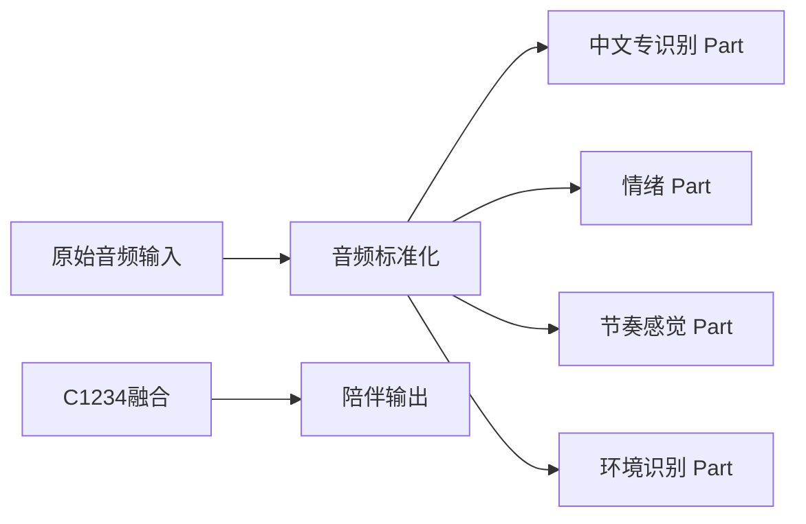

# 单用户中文陪伴语音并行架构

## 整体并行架构图



## 具体应用场景需求
在hcz工作站部署，不在腾讯云
必须量化小于INT9，必须常驻
- 单用户陪伴场景。
- 纯 CPU 语音管线。
- GPU 保留给 dense LLM。
- 中文单一语言。
- 并行管线独立产出。
- 当前落定中文专识别 Part、节奏感觉 Part 与环境识别 Part。

## 警告：禁止小聪明擅自改动

- 禁止把中文识别扩展成多语言自动识别。
- 禁止擅自增加多模型兜底。
- 禁止擅自把情绪、节奏感觉、环境逻辑塞进中文识别。
- 禁止用 LLM 改写原始转录文本。
- 禁止硬 VAD 删除原始音频。
- 禁止为了“兼容”新增并行主干。

## 并行管线 Part

### Part 1：中文专识别

#### 目标

- 原始中文语音提取文字。
- 效果优先。
- 单强模型。
- CPU-only 常驻。

#### 模型

- `SenseVoice-Small`
- `sherpa-onnx`
- `INT8 ONNX`
- 固定 `zh`

#### ASR 专用 VAD

- 只用于中文专识别 Part。
- 默认不启用。
- 只在长静音音频中用于转录分段。
- 不删除原始音频。
- 低阈值切分。
- 短静音合并。
- 每段前后 padding。

#### 管线

```
完整中文音频
  ↓
音频标准化：mono / 16kHz
  ↓
SenseVoice-Small INT8 ONNX 中文转录
  ↓
提取文本 / 标点 / ITN
  ↓
中文文本输出
```

#### 输出

```json
{
  "part": "zh_text_recognition",
  "language": "zh",
  "model": "SenseVoice-Small",
  "backend": "sherpa-onnx",
  "quant": "INT8 ONNX",
  "cpu_only": true,
  "vad_used": false,
  "text": ""
}
```

#### 权威依据

- FunAudioLLM 技术报告 Table 6：`SenseVoice-Small` 在列出的中文数据集上均低于 `Whisper-Small` 与 `Whisper-Large-V3`。
- FunAudioLLM 技术报告 Table 6：`Paraformer-Large` 中文 CER 更低，但不作为本系统主线；本系统优先统一 ASR/SER/AED 多任务能力、INT8 ONNX CPU 常驻部署与低延迟。
- FunAudioLLM 技术报告 Table 7：`SenseVoice-Small` 为 `234M`，A800 batch=1 的 RTF 为 `0.007`，10s 延迟为 `70ms`。
- sherpa-onnx 公开 `SenseVoice-Small INT8 ONNX` 模型，可 CPU 部署。

### Part 2：情绪

#### 目标

- 从完整语音中提取整体情绪分布。
- 效果优先。
- 单强模型。
- CPU-only 常驻。
- 部署在 hcz 工作站。
- GPU 保留给 dense LLM。
- 不要求实时，允许作为慢速并行结果返回。
- 运行形态必须小于 `INT9`。

#### 模型

- `emotion2vec_plus_large`
- `OpenVINO CPU`
- `NNCF` 权重压缩。
- `INT4_ASYM weight-only`
- `group_size=64`
- `ratio=0.9`
- `backup_mode=INT8_ASYM`

#### 量化主干

```
emotion2vec_plus_large
  ↓
完整分类图导出
  ↓
OpenVINO 转换
  ↓
NNCF 权重压缩
  ↓
INT4_ASYM group_size=64 ratio=0.9
  ↓
OpenVINO CPU 常驻推理
```

- 情绪 Part 只保留一条线上运行主干。
- `ratio=0.9` 表示约 90% ratio-defining 参数使用 `INT4_ASYM`。
- 未压到 `INT4` 的敏感权重使用 `INT8_ASYM`。
- 这是单模型内部混合精度，不是多模型兜底。
- 全部线上运行权重位宽必须小于 `INT9`。
- 禁止线上 `FP32` 兜底。
- 禁止 `INT8` 与 `INT4` 双主干运行。
- `FP32` 只允许作为离线精度对照，不进入运行态。

#### 输入约束

- 只接收顶层音频标准化后的完整音频。
- 标准输入为 `16kHz / mono / PCM waveform`。
- 顶层只允许转码或无损压缩转换。
- 情绪 Part 内部禁止做内容感知预处理。

禁止：

- VAD。
- 静音裁剪。
- 滑窗。
- 分块。
- 降噪。
- 响度归一化。
- ASR 文本辅助。
- LLM 二次判断情绪。
- 根据置信度改写情绪标签。

#### 推理粒度

- 固定 `utterance` 粒度。
- 整段完整音频一次进入模型。
- 不按时间片输出情绪。
- 不做帧级情绪聚合。
- 不做多段投票。
- 输出模型原始 9 类情绪分布。

#### 输出标签

- `生气/angry`
- `厌恶/disgusted`
- `恐惧/fearful`
- `开心/happy`
- `中立/neutral`
- `其他/other`
- `难过/sad`
- `吃惊/surprised`
- `<unk>`

#### 输出

```json
{
  "part": "speech_emotion",
  "model": "emotion2vec_plus_large",
  "backend": "openvino",
  "device": "cpu",
  "resident": true,
  "gpu_used": false,
  "quantization": {
    "method": "nncf_weight_compression",
    "mode": "INT4_ASYM",
    "group_size": 64,
    "ratio": 0.9,
    "backup_mode": "INT8_ASYM",
    "online_fp32_fallback": false
  },
  "audio_scope": "full_audio",
  "sample_rate": 16000,
  "channels": 1,
  "granularity": "utterance",
  "vad_used": false,
  "segmentation_used": false,
  "sliding_window_used": false,
  "content_trimmed": false,
  "labels": [
    {
      "label": "中立/neutral",
      "score": 0.0
    }
  ],
  "top_label": "",
  "top_score": 0.0
}
```

#### 当前实验事实

在 hcz 工作站上已完成 `10s` 与 `30s` 两档完整音频实验。

实验约束：

- CPU-only。
- 8 threads。
- 完整 `16kHz mono wav`。
- 无 VAD。
- 无分块。
- 无滑窗。
- 无静音裁剪。
- 完整分类图输出 9 类 softmax。

实验结果：

| 方案 | 10s median | 30s median | 备注 |
|---|---:|---:|---|
| L0：ONNX Runtime INT8 dynamic MatMul | 0.284945s | 1.288479s | 稳定基线 |
| L2：OpenVINO INT4_ASYM g64 r0.9 | 0.225132s | 1.015181s | 采用主线 |

速度收益：

- `10s`：`INT4_ASYM` 相对 `INT8 dynamic` 为 `1.266x`，约快 `21.0%`。
- `30s`：`INT4_ASYM` 相对 `INT8 dynamic` 为 `1.269x`，约快 `21.2%`。

制品体积：

| 制品 | 体积 |
|---|---:|
| FP32 ONNX | 约 757MB |
| INT8 ONNX dynamic | 约 325MB |
| INT4_ASYM OpenVINO | 约 234MB |

#### 风险与边界

- 当前实验只证明 hcz 上 `INT4_ASYM` 对 `INT8 dynamic` 有速度与体积收益。
- 当前实验样本偏中性，不能代表所有情绪类精度。
- 上线前仍需使用真实中文陪伴语音覆盖强情绪样本。
- 如果 `INT4_ASYM` 精度验证失败，不允许增加 `FP32` 线上兜底。
- 如果 `INT4_ASYM` 不满足效果要求，应回到架构层重新讨论情绪 Part 约束，而不是新增第二模型或第二主干。
- 长音频仍可能因完整音频 Transformer 计算增长而变慢；禁止用 VAD、滑窗、分块规避该约束。

### Part 3：节奏感觉

#### 目标

- 从完整语音中提取音节级节律感觉。
- 只输出节奏感觉表征，不做 ASR。
- 效果优先。
- 单强模型。
- CPU-only 常驻。
- 部署在 hcz 工作站。
- GPU 保留给 dense LLM。
- 后续由融合层或词向量系统把节律表征映射为中文感觉词。
- 运行形态必须小于 `INT9`。

#### 模型

- `Sylber 2.0`
- `syllabic embedding representation`
- `INT8`
- 固定本地 CPU 常驻。

#### 主干定义

```
完整中文音频
  ↓
音频标准化：mono / 16kHz
  ↓
Sylber 2.0 INT8 音节级节律表征
  ↓
节律 embedding 聚合
  ↓
节奏感觉输出
```

- 节奏感觉 Part 只保留 `Sylber 2.0 INT8` 一条线上运行主干。
- `Sylber 2.0` 负责输出音节级节律表征，不负责生成自然语言解释。
- `INT8` 是线上唯一允许权重量化形态。
- 禁止线上 `FP32` 兜底。
- 禁止 `Sylber 2.0 INT8` 与其他节律模型双主干运行。
- `FP32` 只允许作为离线精度对照，不进入运行态。

#### 输入约束

- 只接收顶层音频标准化后的完整音频。
- 标准输入为 `16kHz / mono / PCM waveform`。
- 顶层只允许转码或无损压缩转换。
- 节奏感觉 Part 内部禁止做内容感知预处理。

禁止：

- VAD。
- 静音裁剪。
- ASR 文本辅助。
- Whisper 时间戳辅助。
- forced alignment。
- 滑窗。
- 分块投票。
- LLM 二次判断节奏。
- 根据置信度切换模型或兜底模型。

#### 输出粒度

- 固定完整语音粒度。
- 不输出时间戳。
- 不输出停顿边界。
- 不输出精确节拍。
- 不输出音节文本。
- 不输出 ASR 文本。
- 不把节奏感觉伪装成情绪标签。
- 输出供后续词向量系统消费的节律表征与少量感觉词槽位。

#### 输出

```json
{
  "part": "rhythm_feeling",
  "model": "Sylber 2.0",
  "model_family": "syllabic_embedding_representation",
  "backend": "local_cpu",
  "device": "cpu",
  "resident": true,
  "gpu_used": false,
  "quant": "INT8",
  "online_fp32_fallback": false,
  "audio_scope": "full_audio",
  "sample_rate": 16000,
  "channels": 1,
  "vad_used": false,
  "asr_used": false,
  "timestamp_output": false,
  "forced_alignment_used": false,
  "segmentation_output": false,
  "rhythm_embedding": [],
  "rhythm_words": [],
  "confidence": ""
}
```

#### 风险与边界

- `Sylber 2.0` 作为节奏感觉 Part 的唯一主干，不与 ASR、情绪或环境 Part 共用职责。
- 节奏感觉 Part 只产出节律表征；中文感觉词由后续词向量系统映射，不在本 Part 内硬编码规则词库。
- 如果 `Sylber 2.0 INT8` 在 hcz CPU 上不满足效果或效率，不允许增加第二节律模型兜底。
- 如果 `Sylber 2.0 INT8` 不满足上线要求，应回到架构层重新讨论节奏感觉 Part 约束。
- 禁止为了追求精确停顿而引入 VAD、ASR timestamp 或 forced alignment。

### Part 4：环境识别

#### 目标

- 从完整音频中识别背景声音事件。
- 效果优先。
- 单强模型。
- CPU-first 常驻。
- 不做自然语言环境描述。

#### 模型

- `MIT/ast-finetuned-audioset-10-10-0.4593`
- `AudioSet` 多标签音频分类。
- `ONNX Runtime`
- `INT8`
- 使用已有社区 ONNX 量化版本，不自研量化链。

#### 输入约束

- 输入使用音频标准化后的完整音频。
- 统一 `mono / 16kHz`。
- 不使用 VAD。
- 不删除静音。
- 不裁剪人声。
- 不删除低能量音频。
- 不默认做降噪增强。

#### 固定窗口

- 长音频只做固定窗口切片。
- 初版参数：`10s window / 5s stride`。
- 固定窗口只用于控制模型输入长度。
- 固定窗口不是 VAD，不承担语音活动检测或音频筛选职责。

#### 管线

```
完整音频
  ↓
音频标准化：mono / 16kHz
  ↓
固定窗口切片：10s window / 5s stride
  ↓
AST AudioSet INT8 ONNX 常驻模型推理
  ↓
窗口级 top-k 标签与分数
  ↓
数值聚合
  ↓
结构化环境识别结果
```

#### 输出

```json
{
  "part": "environment_recognition",
  "model": "MIT/ast-finetuned-audioset-10-10-0.4593",
  "backend": "onnxruntime",
  "quant": "int8",
  "task": "audioset_multilabel_audio_classification",
  "cpu_first": true,
  "resident": true,
  "sample_rate": 16000,
  "vad_used": false,
  "window_sec": 10.0,
  "stride_sec": 5.0,
  "top_k": 5,
  "segments": [
    {
      "start_sec": 0.0,
      "end_sec": 10.0,
      "labels": [
        {
          "label": "Speech",
          "score": 0.0
        }
      ]
    }
  ],
  "aggregate": [
    {
      "label": "Speech",
      "mean_score": 0.0,
      "max_score": 0.0,
      "hit_count": 0
    }
  ],
  "errors": []
}
```

#### 禁止项

- 禁止多模型 fallback。
- 禁止 `INT8`、`Q4`、`FP32` 自动切换。
- 禁止调用 LLM 改写标签。
- 禁止把环境识别写成自然语言 caption 模型。
- 禁止把 `Q4`、`Q4F16`、`BNB4` 放入初版运行主干。

#### 后续验证

- `Q4`、`Q4F16`、`BNB4` 只作为离线实测候选。
- 若真实样本显示 `INT8` 延迟不可接受，再单独审批是否切换新的单主干量化形态。

### Part 5：融合输出
